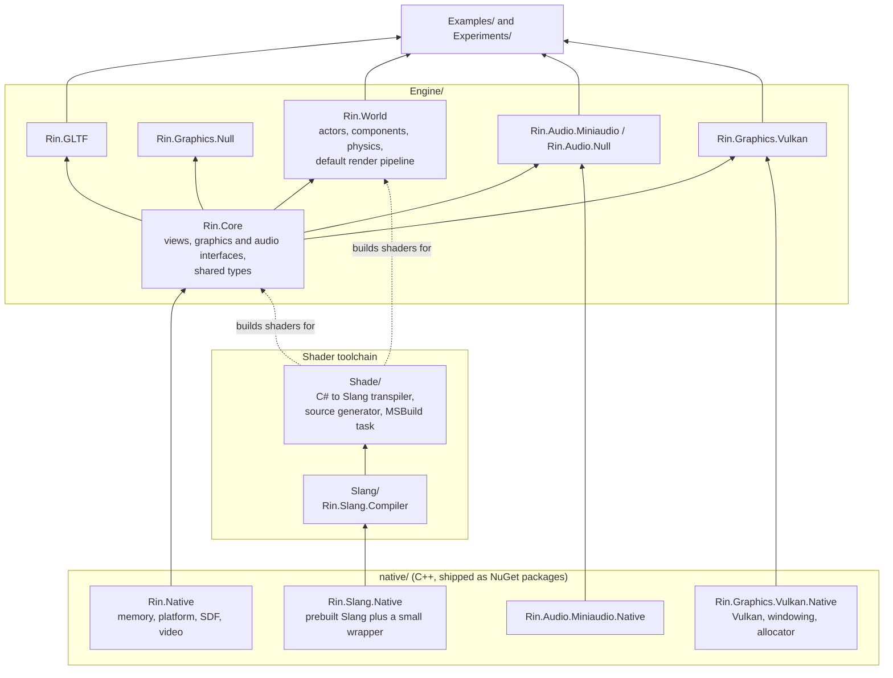
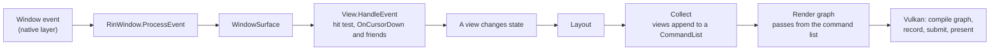
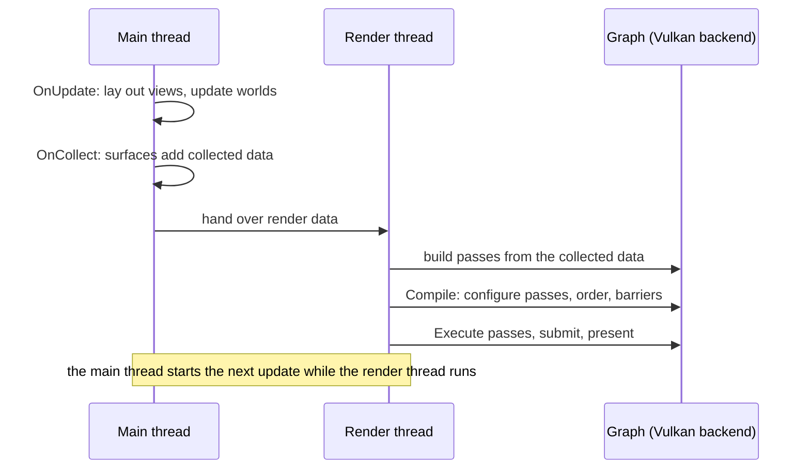

# Architecture

A bird's-eye map of Rin: what the layers are, how a frame moves through them, and the rules the pieces rely on. Each folder and project has a `ReadMe.md` with the detail. This file says how they fit together.

## Layers

Arrows point from a dependency to the thing that uses it. The rule that holds the engine together: **`Rin.Core` defines the interfaces and the backends implement them.** `IGraphicsModule` and `IAudioModule` live in `Rin.Core`, `Rin.Graphics.Vulkan` and `Rin.Audio.Miniaudio` implement them, and the `Null` backends implement them with no-ops. An application picks its backends. The `headless` example (`Examples/Examples/HeadlessTest`) runs a physics world on the null backends, and most examples use Vulkan and Miniaudio through `Examples.Common`.

## From input to pixels

1. The native window layer produces events. The Vulkan backend pumps them each update and routes them by window to `RinWindow.ProcessEvent`. `WindowSurface` turns them into surface events.
2. The `View` tree hit-tests the event, from children to parent, and views react (`OnCursorDown`, `OnScroll`, and so on).
3. Views lay themselves out, then `Collect` walks the tree and appends quads, text, textures, blur and clip commands to a `CommandList`.
4. The `CommandList` becomes render-graph passes: stencil passes for clipping, then draw passes whose commands are merged into batches. Details are in [Engine/Rin.Core/ReadMe.md](Engine/Rin.Core/ReadMe.md).

## One frame

A **pass** declares the images and buffers it reads and writes in `Configure`, and records GPU work in `Execute`. The graph orders passes from those declarations, prunes passes nothing terminal depends on, adds upload passes and inserts the barriers. The interfaces are in `Rin.Core` (`IPass`, `IGraphConfig`, `IGraphBuilder`), and the implementation is in `Rin.Graphics.Vulkan`. See [Engine/Rin.Graphics.Vulkan/ReadMe.md](Engine/Rin.Graphics.Vulkan/ReadMe.md).

## Worlds on a surface

`Rin.World` models a world as actors with components, with a fixed-step physics system (Bepu). The world does not draw directly. Components push changes into a command queue, the renderer takes a **snapshot** of them, and the default pipeline turns the snapshot into passes: skinning, culling, indirect draw preparation (or plain per-mesh draws on devices without indirect rendering), a G-buffer fill, and a lighting pass. A `Viewport` view and its command handler put the world's output on a surface. See [Engine/Rin.World/ReadMe.md](Engine/Rin.World/ReadMe.md).

## Shaders

Shaders are C# classes. `Rin.Shade` transpiles them to Slang during the build, `Rin.Slang.Compiler` compiles that to a package with SPIR-V and reflection, and the package is embedded as a resource. At run time the backend loads it by the path on the shader class, and the pipeline state (attachment formats, blend, depth and stencil) comes from a generated `Descriptor` on the same class. There are no hand-written `.slang` files in the repo. See [Shade/ReadMe.md](Shade/ReadMe.md).

## Rules the code relies on

- **Matrices are row-major with row-vector math** everywhere, matching `System.Numerics`. The CPU tests in `Shade/Rin.Shade.CpuTests` check that the Slang side agrees.
- **Push constants and buffers use scalar layout.** Shaders reach buffers through `BufferRef<T>` addresses passed as push constants.
- **Resources are bindless.** Shaders sample textures through the engine-owned `rin.global` block with a `DeviceHandle`. The engine binds that descriptor set once per frame.
- **Handles are generational.** A `ResourceHandle` carries a generation so a freed and reused slot is detected.
- **Zero-sized images and buffers are rejected** at the create calls, with an exception.
- **No allocation in per-frame, per-draw or per-item paths.** Build-time tooling is exempt. See [AGENTS.md](AGENTS.md).

## Native libraries and CI

A native library reaches the managed code in one of three ways: a **real** package built from C++ (locally with `uv run task pack-all`, in CI for Slang), a **stub** package that only satisfies restore, or a **fake** NativeAOT library that tests load instead. [native/ReadMe.md](native/ReadMe.md) explains each, and CI (`.github/workflows/ci.yml`) uses all three: stubs and fakes for the per-project test jobs, and the real Slang for the CPU shader tests and the full shader compile.

## Where to read next

- [ReadMe.md](ReadMe.md): setup, build and test commands, and the index of every ReadMe
- [Shade/ReadMe.md](Shade/ReadMe.md): the shader pipeline in depth
- [Engine/Rin.Core/ReadMe.md](Engine/Rin.Core/ReadMe.md): views and the graphics graph in depth
