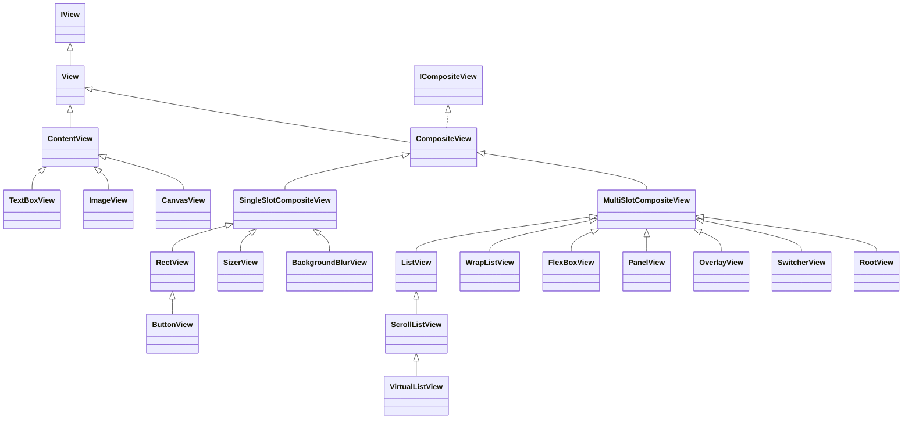
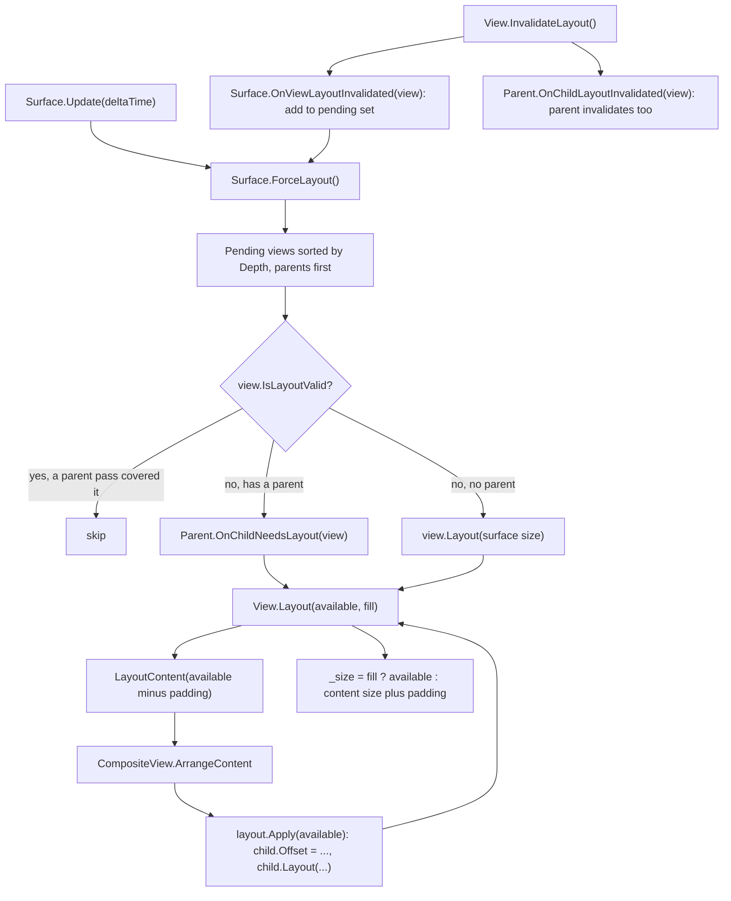
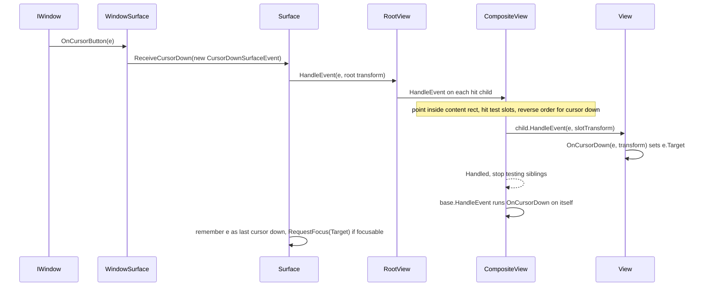
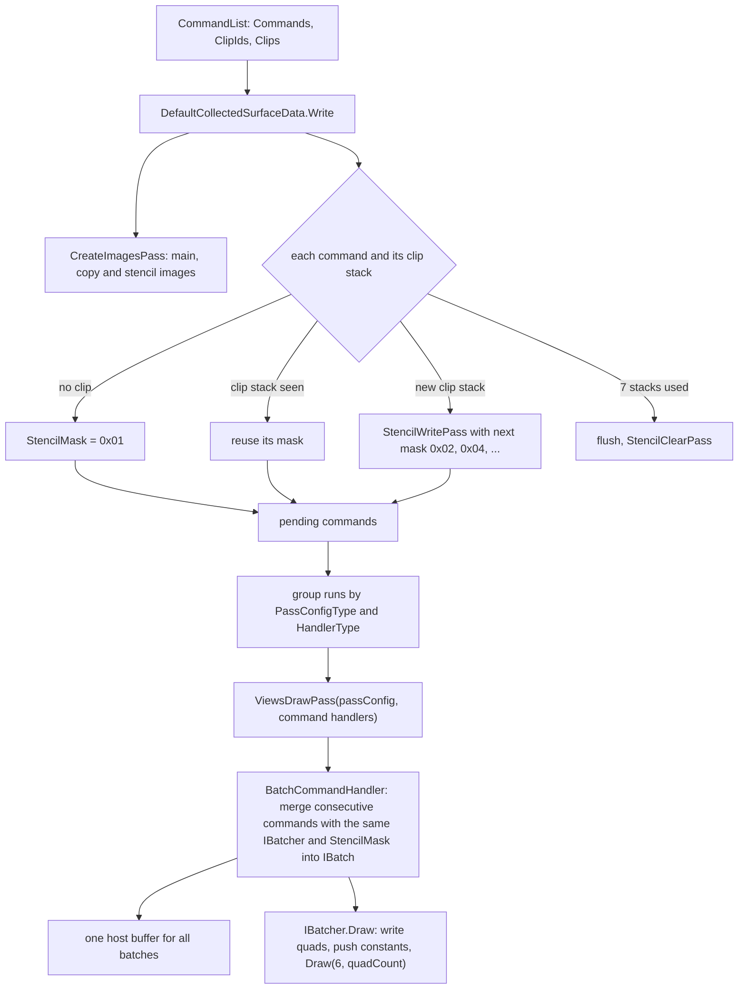
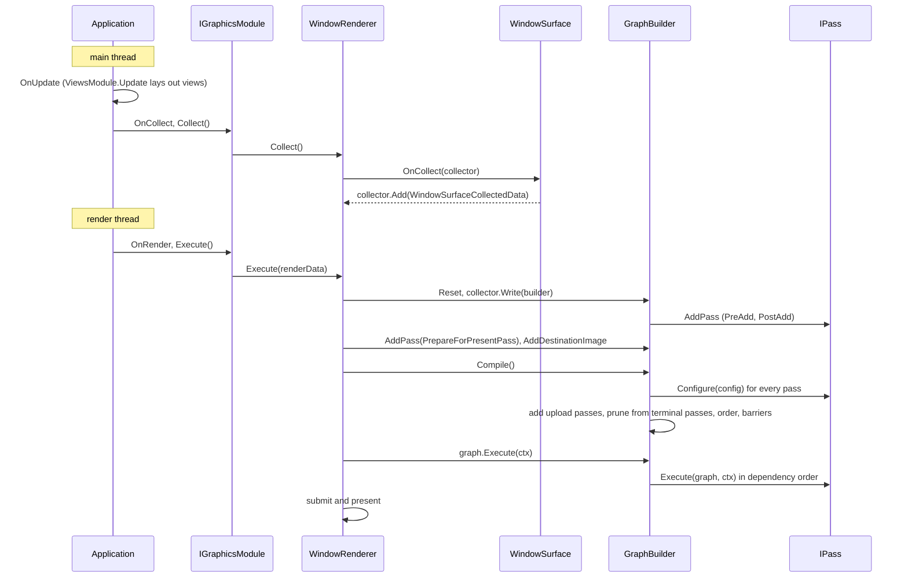

# Rin.Core

The base library of the engine. It defines the application and module model, the graphics and audio interfaces that backends implement, the views (UI) system, and shared utilities. Package id `TareHimself.Rin.Core`.

## Where it fits

- References: `Rin.SourceGenerators` (as an analyzer), `Shade/Rin.Shade` and `Shade/Rin.Shade.SourceGenerator`, plus NuGet packages including NetVips, SQLite, HarfBuzzSharp and `TareHimself.Rin.Native`.
- Referenced by: Rin.World, Rin.Graphics.Vulkan, Rin.Graphics.Null, Rin.Audio.Miniaudio, Rin.Audio.Null, Rin.Core.Tests and Rin.SourceGenerators.Tests.
- Rin.Core only holds the graphics interfaces. The frame graph is implemented by the backend (see [Rin.Graphics.Vulkan](../Rin.Graphics.Vulkan/ReadMe.md)).

## Build and test

```
dotnet build Engine/Rin.Core/Rin.Core.csproj
dotnet test Engine/Rin.Core.Tests/Rin.Core.Tests.csproj -p:RinShadeSkipCompile=true
```

`-p:RinShadeSkipCompile=true` skips the shader compile step, which these tests do not need. The tests are described in [Rin.Core.Tests](../Rin.Core.Tests/ReadMe.md). Unsafe code is enabled and the project is marked AOT compatible.

## Shaders

- The shaders are C# classes written with Rin.Shade, under `Views/Graphics/Shaders/` (`QuadBatchShader`, `ImageBatchShader`, `StencilBatchShader`, `BlurShader`, plus the helpers `ViewShader`, `ViewShaderMath` and `Sd`). Each declares an output path such as `[Shader("Shaders/Rin/Core/Views/quad_batch.slang")]`. There are no hand-written `.slang` files in this project.
- `Rin.Core.csproj` sets `RinShadeDiscoverPrefix` to `Shaders/Rin/Core/` and `RinShadeOutputSubpath` to `Content\Shaders\Rin\Core\`, and imports `msbuild/RinShade.targets`. The build transpiles and compiles the shaders into that folder, and `Content\**` is embedded as resources. `Global.Sources` reads them back through `AssemblyContentResource.New<Global>("Shaders/Rin/Core")`.
- Rin.Core is a `[ShadeExport]` source for other assemblies: `ViewShader<T>`, `DeviceHandle`, `BindlessData` and `Int4` carry the attribute, so shaders in other projects can use them. `Rin.World` does this, for example `ViewportShader : ViewShader<...>` and `MeshShader` using `BindlessData`. The pipeline is described in [Shade](../../Shade/ReadMe.md).

## Views

Source: `Views/`. A `View` is one node of a tree that lives on a `Surface`. Each frame the surface lays the tree out, routes input to it, and collects draw commands from it.

### View tree



- `View` owns the transform (`Offset`, `Translate`, `Pivot`, `Scale`, `Angle`), `Padding`, `Visibility`, hover state, and the layout and event entry points. A subclass implements `LayoutContent` and `Collect`.
- `ContentView` is a leaf. Subclasses implement `CollectContent`, and `Collect` applies the padding offset before calling it. Examples under `Views/Content/`: `TextBoxView`, `TextInputBoxView`, `ImageView`, `CanvasView` (a `Paint` callback), `ProgressBarView`, `FontIconView`, `VideoPlayerView`.
- `CompositeView` holds children in slots (`ISlot`, each with a `Child`). It owns child collection, clipping, hit testing, and invalidation cascade. A subclass implements `ArrangeContent` and `GetSlots`.
- `SingleSlotCompositeView` holds one child (`SetChild`, `InitChild`). `MultiSlotCompositeView<TSlot>` has `Add`, `Remove` and `SlotCount`, and the concrete views delegate to an `InfiniteChildrenLayout` object.
- `Visibility` values: `Visible`, `VisibleNoHitTestSelf`, `VisibleNoHitTestChildren`, `VisibleNoHitTestAll`, `Hidden` (takes space, not drawn) and `Collapsed` (takes no space, desired size is zero).
- `Surface` creates a private `RootView`. `Surface.Add(view)` adds to it. `ViewsModule` creates one `WindowSurface` per window renderer.

### Layout

Layout objects (`Views/Layouts/`) are plain classes that a composite view delegates to: `ListLayout` (row or column), `WrapListLayout`, `FlexLayout`, `PanelLayout`, `OverlayLayout`, `SwitcherLayout` and `RootLayout`. `Apply(availableSpace)` positions the children by setting `Offset` and calling `Layout` on them, and returns the space taken.

| Layout | What it does |
| --- | --- |
| `ListLayout` | Stacks children along the axis with infinite space on the main axis. Each `ListSlot` has `Align` (start, center, end) and `Fit` (`Desired`, `Available`, `Fill`) for the cross axis. |
| `WrapListLayout` | Like `ListLayout`, but starts a new line when the next child would pass the main axis limit. |
| `FlexLayout` | Lays out children without a `Flex` value first, then splits the remaining main axis space between `FlexBoxSlot`s by their `Flex` weights. |
| `PanelLayout` | Each `PanelSlot` has min and max anchors, an offset, a size, an alignment and `SizeToContent`. Matching anchors give an absolute placement, different anchors stretch. |
| `OverlayLayout` | Lays out every child at offset zero. Children with a non-zero desired size are laid out first and set the size, then all children are laid out to that size. |
| `SwitcherLayout` | Only the child at `SelectedIndex` is laid out. |
| `RootLayout` | Lays out each child at zero offset in the full space. |

`SwitcherView` overrides `GetActiveSlots` to return only the selected slot, so only that child is laid out, updated, drawn and hit tested. Surface and dispose handling use `GetSlots`, which returns all of them. `SizerView` and `ConstraintView` wrap one child and override or clamp its size.

Desired size versus available space: `GetDesiredSize()` is what the view would like (`ComputeDesiredContentSize()` plus padding, cached once the view is on a surface, zero when `Collapsed`). The available space is what the parent passes into `Layout(availableSpace, fill)`. Containers use desired size to pick cross axis sizes and use available space to limit the main axis.



Invalidation: `InvalidateLayout()` marks the view invalid, tells the parent, and registers the view with the surface. `CompositeView.InvalidateLayout()` also invalidates children that are still valid. `InvalidateDesiredSize()` clears the cached desired size only. Setting `Padding`, `Visibility` (to or from `Collapsed`) and most container properties call both. `Surface.Update` calls `ForceLayout()` after updating the tree so `Collect` never has to compute layout. `GetSize()` and `Offset` also call `ForceLayout()` when the view is invalid, guarded by an `_isCalculatingLayout` flag.

### Events and hit testing

`ISurfaceEvent` (carries its `Surface`) is the base. `IPositionalEvent` adds `Position` and `ReverseTestOrder`, `IHandleableEvent` adds `Handled`, `ITargetedEvent` adds `Target`. Concrete events: `CursorDownSurfaceEvent`, `CursorUpSurfaceEvent`, `CursorMoveSurfaceEvent` (collects `Over`), `ScrollSurfaceEvent`, `CharacterSurfaceEvent`, `KeyboardSurfaceEvent`, `ResizeSurfaceEvent`.



- `WindowSurface.Init` subscribes to the window events (`OnCursorButton`, `OnCursorMoved`, `OnScroll`, `OnKey`, `OnCharacter`, `OnResize`, `OnCursorFocus`) and converts each into a surface event. Pressed becomes cursor down, released becomes cursor up, repeat is ignored.
- `CompositeView.HandleEvent` handles positional events in two steps. If the point is inside its content rect, it hit tests its active slots (`ComputeHitTestableSlotsForEvent`) and calls `child.HandleEvent` on each hit slot. For `IHandleableEvent` it stops once `Handled` is true. Then it calls `View.HandleEvent` on itself.
- `View.HandleEvent` dispatches by event type. Cursor down calls `OnCursorDown`. Cursor move adds the view to `Over`, calls `OnCursorEnter` the first time, and calls `OnCursorMove` unless the event is already handled. Scroll sets `Target` when `OnScroll` returns true.
- Order: cursor down tests children from last to first (the topmost drawn view first, `ReverseTestOrder` is true). Cursor move and scroll test first to last.
- `ScrollListView` scrolls by wheel, by dragging the content, or by dragging its bar (a cursor down within `BarHitPadding` of the bar drags the bar until release). `VirtualListView` is a `ScrollListView` of `ItemCount` fixed-size items that keeps views only for the visible window plus an overscan, rebinding recycled rows through a bind callback as it scrolls.
- A view takes a cursor down by setting `e.Target` (as `ButtonView` does when it has `OnPressed` or `OnReleased` handlers, and `ScrollListView` and `TextInputBoxView` always do). `Handled` is `Target != null`.
- Cursor up is not hit tested. `Surface.ReceiveCursorUp` raises `OnCursorUp` and then calls `OnCursorUp` on the target of the last cursor down. Cursor move also forwards to that target, so a drag keeps working outside its bounds.
- `Surface.Update` runs `DoHover` while the cursor is in the window. It sends a cursor move event so `IsHovered` stays current, and calls `NotifyCursorLeave` on views no longer under the cursor.
- Keyboard and character events go straight to `Surface.FocusedView`. `RequestFocus` needs `IsFocusable` and `IsHitTestable`.

### Drawing

`Collect(transform, clip, commands)` walks the tree and appends commands to a `CommandList`. `CompositeView.Collect` skips children outside the clip rect, collects the rest in slot order, and when `Clip == Clip.Bounds` and it has a parent it brackets them with `PushClip` and `PopClip`. Leaf views call helpers from `QuadExtensions`: `AddRect`, `AddCircle`, `AddLine`, `AddQuadraticCurve`, `AddCubicCurve`, `AddTexture`, `AddMtsdf` and `AddText` (one MTSDF quad per glyph from the font atlas). `AddBlur` (in `Views/Graphics/Blur/`) is used by `BackgroundBlurView`.

Data path from window to GPU:

1. `WindowSurface` handles `Renderer.OnCollect` and adds a `WindowSurfaceCollectedData` for the `CommandList` returned by `Surface.CollectCommands()` (nothing is added when it has no commands).
2. `DefaultCollectedSurfaceData.Write(builder)` turns the list into passes and adds them to the graph. `WindowSurfaceCollectedData` appends a `CopyToDestination` pass that copies the main image to the window's destination image.



- `QuadDrawCommand` is a `TCommand<MainPassConfig, BatchCommandHandler>` and an `IBatchedCommand`. Its batcher is `DefaultQuadBatcher` (marked `[ViewsBatcher]`, a `SimpleQuadBatcher<QuadBatch>`), fetched through `IViewsModule.GetBatcher<T>()`.
- A `Quad` holds a mode (`Line`, `Circle`, `Rectangle`, `QuadraticCurve`, `CubicCurve`, `Texture`, `Mtsdf`, `ColorWheel`), a size, a transform and mode specific data. `QuadBatchShader` draws 6 vertices per quad instance, reads the quad from a buffer address in its push constants, and switches on the mode in the fragment function. Textures are sampled through `BindlessData` with a `DeviceHandle`. `QuadBatch.DeclareResources` registers each referenced texture with `config.AddExternalImage` and `ReadTexture` so it stays alive for the frame.
- Clipping uses the stencil buffer. `StencilWritePass` draws the clip rectangles (`StencilBatchShader`, instanced, fragments outside the rounded rectangle discarded) with a write mask. Draws then compare against `StencilMask`, which `BatchCommandHandler` sets with `SetStencilCompareMask` when the mask changes. A new `StencilClearPass` is added after 7 distinct clip stacks.
- Blur: `AddBlur` adds four commands: `BlurInitCommand`, `BlurFirstPassCommand`, a `NoOpCommand`, and `BlurSecondPassCommand`. The init handler copies the covered region of the main image into a smaller texture (reduced by `7 / radius`, clamped to at least 5 percent of the region), the first pass blurs it horizontally, and the second pass blurs it vertically and draws it over the region in the main pass, using `BlurShader`. A `NoOpCommand` ends the current group, so the blur breaks batching around it.
- `Surface`, `SurfaceContext` and `FrameStats` expose the surface size, projection and image ids (`MainImageId`, `CopyImageId`, `StencilImageId`). `FrameStats` is declared but this README did not check where it is filled in.

Text: `Views/Font/` (`IFontManager`, `HarfBuzzFontManager`) shapes text with HarfBuzz. `Views/Mtsdf/` and `Views/Sdf/` build and cache multi-channel signed distance field glyphs in atlas textures (including a disk cache, `DiskSdfCache`). The default font is `Content/Core/Fonts/NotoSans-Regular.ttf`, loaded in `ViewsModule.Start`.

## Graphics graph

Source: `Graphics/Graph/` (interfaces) with `Graphics/IGraphicsModule.cs`. The implementation of the builder, compiler and executor is `Rin.Graphics.Vulkan/Graph/` (`GraphBuilder`, `GraphConfig`, `CompiledGraph`). `Rin.Graphics.Null` is the no-op backend.

- `IPass`: `Id`, `Configure(IGraphConfig)` and `Execute(ICompiledGraph, IExecutionContext)`. `Configure` should do the least work needed to state what the pass uses. `Execute` records the GPU work.
- `IGraphBuilder`: `AddPass`, `AddExternalImage`, `AddExternalBuffer`, `AddDisposable` (disposed after the frame finishes) and `GetOrAddShared` (lets several contributors share one pass or resource). External resources used in `Execute` must be registered.
- `IPassWithPreAdd` and `IPassWithPostAdd` get callbacks just before and after `AddPass` (`ViewsDrawPass` uses them for its handlers). `ITerminalPass` marks a pass that must run. Passes that nothing terminal depends on are pruned, and a graph with no terminal pass runs nothing. `ActionPass` and `TerminalActionPass` are callback based passes, and `builder.AddPass(configure, run, terminal)` builds one.
- `IGraphConfig` is how a pass declares resources, by `uint` id (0 is invalid): `CreateTexture`, `CreateTextureArray`, `CreateCubemap`, `CreateBuffer` (with a `GraphBufferUsage` such as `HostThenGraphics`), `AddExternalImage`, `AddExternalBuffer`, and `ReadTexture` or `WriteTexture` (with an `ImageLayout`) and `ReadBuffer` or `WriteBuffer` for existing ids. `DestinationImageId` is the window image. The Vulkan builder derives pass order from these reads and writes (a read depends on the last earlier write, a write depends on earlier reads and the previous write) and `DependOn(passId)` adds an explicit dependency.
- `ICompiledGraph`: `GetImage(id)`, `GetBuffer(id)` and `Execute`. In the Vulkan backend the resources are created when first requested. Extensions: `GetImageOrException`, `GetBufferOrNull`, `GetBufferOrException`.
- `IGraphCollector.Add(ICollectedData)`: subsystems hand collected data to the renderer. `ICollectedData.Write(IGraphBuilder)` turns it into passes later.
- `IGraphicsModule` is the backend entry point: windows and renderers (`AddRenderer`, `GetWindowRenderers`), shader creation (`MakeGraphics`, `MakeCompute`, from a path or a descriptor), resource creation (`CreateBuffer`, `CreateTexture`, `CreateTextureArray`, `CreateCubemap`, uploads via `QueueTextureUpload` and `QueueBufferUpload`), `FreeResourceHandles`, and `Collect()` and `Execute()`.
- `IRenderer.Collect()` runs on the main thread and returns `IRenderData` (or null). `Execute(IRenderData)` runs on the render thread. `IWindowRenderer` adds the `OnCollect` event that surfaces subscribe to.
- Shaders: `[GraphicsShader<T>]` and `[ComputeShader<T>]` on a `partial` property make the source generator emit a property that creates the shader through `IGraphicsModule.Get()`. `IGraphicsShader.Bind(ctx)` returns an `IGraphicsBindContext` (`Push`, `WriteBuffer`, `Draw`, `DrawIndexed` and indirect variants) or null.

Resource handles (`Graphics/ResourceHandle.cs`, `Graphics/BindlessData.cs`):

- `ResourceHandle` is the CPU side handle: a `ResourceType` (`Texture`, `Cubemap`, `TextureArray`, `Buffer`), an id, `IsBindless` and a `Generation` that detects a freed and reused slot. `IsValid()` asks the graphics module.
- `DeviceHandle` is the 32 bit GPU visible part (type in the low 7 bits, id in bits 8 to 31). `ResourceHandle` converts to it implicitly, never the other way. It is `[ShadeExport]`.
- `BindlessData` is the shader side global block named `rin.global`: 6 samplers, 2048 textures, 512 texture arrays and 512 cubemaps, with `SampleTexture`, `TexelLoad` and `GetTextureSize` taking a `DeviceHandle`.
- `DeviceBufferView` is a buffer handle with an offset and size, with `Write`, `GetAddress` and sub views. Shaders reach buffers through `BufferRef<T>` addresses pushed as constants.

One frame (the Vulkan backend, checked in `Application.Run`, `VulkanGraphicsModule` and `WindowRenderer`):



The main thread waits for the previous render to finish before it runs `OnCollect`, then lets the render thread run `OnRender` while it starts the next update. The Vulkan `WindowRenderer` builds the passes from the collected data at the start of its `Execute` (render thread), not in `Collect`.

## Other top-level folders

- `Animation/`: `AnimationRunner`, `IAnimation`, transition animations for floats and vectors, delays and sequences. Views run an `AnimationRunner` in `Update`.
- `Archives/`: `IArchive` interfaces and `SqliteArchive`, a SQLite backed read and write archive (`Views/Sdf/SdfArchive.cs` uses it).
- `Audio/`: `IAudioModule`, samples, groups, channels, push streams, and the effect model under `Audio/Effects/`.
- `Content/`: embedded resources: `Core/Fonts/NotoSans-Regular.ttf` and `Core/Textures/default.png`.
- `Extensions/`: extension methods for strings, enumerables, dictionaries, streams, tasks, JSON, buffers, characters and `AttachmentFormat`.
- `Graphics/`: the graphics abstraction: module, renderers, frame graph interfaces, handles, shader interfaces, windows and window events, input keys, images, rects and extents.
- `Json/`: JSON converters for `Vector2`, `Vector3` and `Vector4`.
- `Properties/`: `launchSettings.json`.
- `Shared/`: math (`MathR`, easing, `Transform`, `Frustum`, `Int4`), curves, buffers, `Dispatcher`, id factory, logging, pooling, providers (`DefaultProvider`), threading helpers, time, profiling, and video sources and player.
- `Sources/`: `ISource`, `SourceResolver`, `FileSystemSource` and embedded resource sources. `Global.Sources` combines the file system and the embedded `Core` and `Shaders/Rin/Core` content.
- `Views/`: the UI system described above, plus `Animation/` (view animation extensions), `Font/`, `Mtsdf/`, `Sdf/`, `Utilities/` (`HitTestHandler`) and `Window/`.
- Root files: `Application` (main and render thread loop, module startup), `IApplication`, `IModule`, `Global` (service provider and sources), `Native` (P/Invoke into the native library), and small utilities.

## Gotchas

- `View.Layout(available)` returns the content size plus padding, not the available space, unless `fill` is true. A view only fills its slot when the parent passes `fill` or the layout lays it out in a way that returns the space (for example `RootLayout` and `PanelLayout` return the available space).
- Reading `GetSize()` or `Offset` on a view with invalid layout triggers `Surface.ForceLayout()`, so a getter can run a layout pass.
- The desired size is cached only when the view is on a surface. After changing something that affects it, call `InvalidateDesiredSize()` and `InvalidateLayout()`.
- `View.HandleEvent` calls `OnCursorDown` on a view even after a child already handled the event, because it does not check `Handled`. Check `e.Handled` in `OnCursorDown` if a view should defer to its children.
- `CursorEnterSurfaceEvent` is handled in `View.HandleEvent` but nothing in Rin.Core creates it. Hover enter comes from the cursor move path.
- `Clip.Bounds` only pushes a clip when the view has a parent. Each distinct clip stack costs a stencil write, and an eighth stack in a run forces a stencil clear.
- A texture used in a `QuadDrawCommand` must still be alive when the frame is built. `QuadBatch.DeclareResources` asserts that the id is valid.
- A graph with no `ITerminalPass` draws nothing. The Vulkan window renderer always adds `PrepareForPresentPass` for this reason.
- After changing shader C# the Rin.Shade MSBuild task may need a rebuild. Tests that never load shader content can use `-p:RinShadeSkipCompile=true`.
