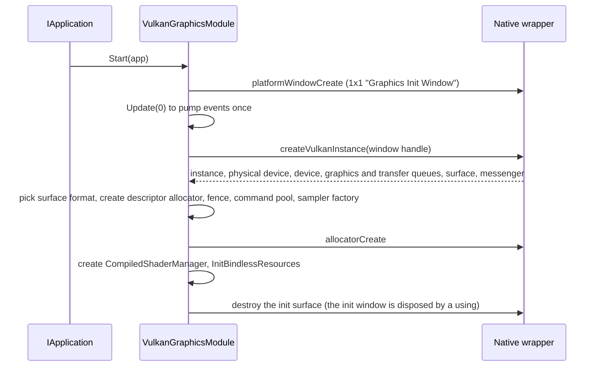
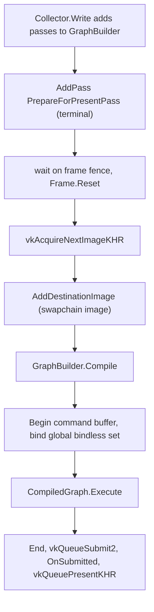
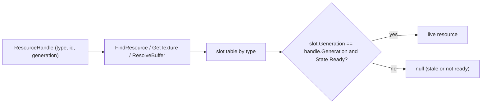
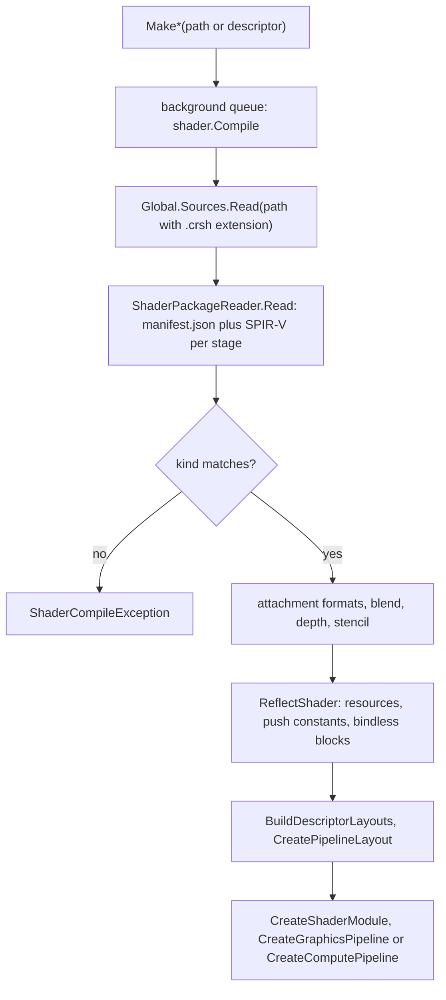

# Rin.Graphics.Vulkan

Vulkan backend for the `IGraphicsModule` interface from Rin.Core. Package id `TareHimself.Rin.Graphics.Vulkan`. It uses the TerraFX Vulkan bindings for Vulkan calls and a native wrapper (`TareHimself.Rin.Graphics.Vulkan.Native`) for instance and device creation, the memory allocator, windows and window events (`Native.cs`).

## Where it fits

- References (default `local_file` mode): [Rin.Core](../Rin.Core/ReadMe.md) and `Slang/Rin.Slang` ([ReadMe](../../Slang/Rin.Slang/ReadMe.md)). In `online` mode it uses the matching NuGet packages instead.
- Also uses the `TareHimself.Rin.Graphics.Vulkan.Native` package ([source](../../native/Rin.Graphics.Vulkan.Native/ReadMe.md)) and `TerraFX.Interop.Vulkan`.
- Referenced by `Examples/Common`, `Examples/NodeGraphTest` and several projects under `Experiments/`. No project under `Engine/` references it.
- Unsafe code is enabled and the project is marked AOT compatible. Native calls use `LibraryImport` with runtime marshalling disabled.

## Source map

| Path | What it holds |
| --- | --- |
| `VulkanGraphicsModule.cs` | Module entry point: start, stop, update, collect, execute, windows, shader factory methods, image creation helpers. |
| `VulkanGraphicsModule.Resources.cs` | Resource registry, bindless descriptor set, buffer registry, pending-write flushing. |
| `WindowRenderer.cs`, `Frame.cs` | Per-window swapchain and the per-frame draw. One `Frame` holds a command buffer, a fence, a swapchain semaphore, a descriptor allocator and a `GraphBuilder`. |
| `Windows/RinWindow.cs` | `IWindow` implementation over a native window handle. |
| `Graph/` | Render graph: `GraphBuilder`, `GraphConfig`, `CompiledGraph`, `ResourcePool`, barrier and upload passes. |
| `Images/`, `Descriptors/` | Bindless slot tables and handle state, descriptor sets, pools and layouts. |
| `Shaders/` | `CompiledGraphicsShader`, `CompiledComputeShader`, `CompiledShaderManager`, bind contexts. |
| `ResourceLanes.cs`, `BufferWriteLanes.cs`, `TextureWriteLanes.cs`, `WriteRecorder.cs`, `Pending*Write.cs` | Queued CPU-to-GPU writes. |

## Module: startup, device, update pump

`VulkanGraphicsModule.Start` subscribes `Update`, `Collect` and `Execute` to the application's `OnUpdate`, `OnCollect` and `OnRender` events, then runs `InitVulkan`.



- Queues and queue families come back from `createVulkanInstance`. The module keeps a graphics queue and a transfer queue, but the transfer queue is only stored and exposed through `GetTransferQueue`. All submits in this project use the graphics queue.
- Surface format: the formats the init surface reports are filtered with a regex on the format name (`R` or `B` channel order, 8 or more bits per channel, with alpha, `UNORM`). The first match is used, otherwise `R8G8B8A8_UNORM` with `SRGB_NONLINEAR`.
- `Update` calls `Native.platformWindowPump`, then reads native events in batches of up to 64 until a read returns zero. Each event is routed by `windowId` to a `RinWindow` through `ProcessEvent`, which raises the matching C# event (`OnKey`, `OnResize`, `OnClose`, and so on).
- `Collect` asks every renderer for an `IRenderData` and stores the result. `Execute` runs pending `GraphicsSubmit` actions, runs each collected renderer, then calls `FlushPendingWrites`.
- `CreateWindow` makes a `RinWindow`, builds a `WindowRenderer` for it and registers it. Disposing the window removes the renderer.
- `GraphicsSubmit(Action<IExecutionContext>)` queues an action. It runs at the start of the next `Execute` in one command buffer that is submitted and waited on with a fence. The returned task completes after that wait.
- `Stop` unhooks the events, disposes windows, then the task queue, descriptor allocator, shader manager, bindless resources, layout and sampler factories, the allocator, device and instance, in that order.

## Render graph

A window renderer builds a new graph every frame. `WindowRenderer.DoCollect` (called from `Collect`) invokes `OnCollect` so callers can register data on a `GraphCollector`. `DoExecute` writes that data into the frame's `GraphBuilder`, adds `PrepareForPresentPass`, waits on the frame fence, acquires a swapchain image, registers it as the destination image, compiles, records and submits.



`GraphBuilder.Compile` does the following, in order:

1. `Configure`: every pass's `Configure(config)` runs against a `GraphConfig`. The config records, per resource id, a list of `ResourceAction` (read or write, with image layout or `GraphBufferUsage`) and, per pass, its dependencies. `CreateTexture`, `CreateTextureArray`, `CreateCubemap` and `CreateBuffer` only record descriptors here. `FillResources` then turns them into `TextureResourceDescriptor`, `CubemapResourceDescriptor`, `TextureArrayResourceDescriptor` and `BufferResourceDescriptor`, and image usage flags are derived from the layouts requested.
2. `SynthesizeUploads`: for each external texture or buffer that the graph uses and that has queued writes, a `TextureUploadPass` or `BufferUploadPass` is added. Its `Configure` moves a transfer write to the front of that resource's action list, so the upload is ordered before the first user.
3. If no pass is an `ITerminalPass`, everything is disposed and `Compile` returns `null`.
4. `CollectLivePasses` walks back from the terminal passes. A read depends on the last earlier write. A write depends on the previous write and the reads between. Passes not reached are disposed and dropped.
5. `TakeUploads`: for the live upload passes, pending writes are taken out of the lanes (see below), one staging buffer is created for the frame, and each pass is given its slice.
6. `BuildSyncs`: consecutive actions on the same resource become `ImageResourceSync` or `BufferResourceSync` entries attached to the later pass. An image sync is emitted when the operation is a write, the layout changes or the operation kind changes. A buffer sync is emitted when the operation kind changes or the operation is a write. An external image's first use transitions from its current layout unless the write discards it. The swapchain image always starts from `Undefined`.
7. `ScheduleLevels` assigns each live pass a level one past its deepest dependency. `BuildExecutionGroups` puts a `BarrierPass` holding the level's syncs in front of that level's group.
8. `CollectLiveResources` keeps descriptors that a live pass uses and releases unused external resources. The result is a `CompiledGraph` that owns this frame's disposables.

`CompiledGraph.Execute` walks the groups in order and calls `Execute` on each pass one after another (no parallel recording). Resources are created lazily: `GetImage(id)` and `GetBuffer(id)` ask the `ResourcePool` on first use and cache the result for the frame. External resources are wrapped from the handle the caller registered. `BarrierPass.Execute` turns syncs into `vkCmdPipelineBarrier2` calls, using `ImageBarrierOptions` (stages and access from the old and new layout) and `MemoryBarrierOptions` (stages and access from `GraphBufferUsage`). It uses stack space or `ArrayPool` for the barrier arrays.

`ResourcePool` keeps pooled textures, texture arrays, cubemaps and buffers, keyed by the descriptor's hash. A returned resource goes back to a free list stamped with the frame number. Buffers can also be reused if the free buffer is at least as large, has identical usage flags and is no more than 1024 bytes larger. Eviction is effectively disabled (`MaxIdleFrames` and `MaxIdlePerKey` default to the maximum values), so pooled resources live until the pool is disposed. The comment above those fields gives a Vulkan validation layer false positive as the reason.

Only one frame is in flight per window (`FramesInFlight = 1` in `WindowRenderer`).

## Queued writes (upload lanes)

`CreateTexture(out handle, data, ...)`, `QueueTextureUpload` and `QueueBufferUpload` copy the data into pooled memory and enqueue a `PendingTextureWrite` or `PendingBufferWrite` in a lane (`TextureWriteLanes`, `BufferWriteLanes`, both `ResourceLanes<T>`). A lane is a list per resource handle, with a round-robin order across handles.

- Merging at enqueue: a texture write that covers the whole image replaces the earlier writes in that lane. A buffer write replaces the last write when it covers its range. The replaced write's completion tasks move to the new write.
- Graph path: if the target resource is used by a graph, its upload pass consumes the queued writes inside the graph, ordered by the barriers above. `OnSubmitted` completes their tasks after the queue submit.
- Fallback path: at the end of `Execute`, `FlushPendingWrites` takes up to 64 writes per kind (texture, buffer) that no graph consumed, takes a reference on each target, records copies into one staging buffer, submits and waits on the fence, then completes the tasks. Writes whose target cannot be acquired are disposed and their tasks are cancelled. Anything beyond 64 waits for a later frame.
- Staging sizes are rounded up to 16 bytes. `WriteRecorder` brackets buffer copies with its own barriers because buffers are also read by device address outside the graph.

## Resource registry and bindless descriptors

Every texture, texture array, cubemap and buffer lives in a slot table (`ResourceSlots<T>`) and is referred to by a `ResourceHandle` (type, id, `IsBindless`, `Generation`). Only type and id reach shaders (`DeviceHandle`).



- Id 0 is reserved as invalid in each table. Ids come from an `IdFactory<uint>` per type. Textures have 2048 slots, texture arrays 512, cubemaps 512 (`BindlessData` in Rin.Core). Buffers have no fixed small cap (up to 1024 chunks of 1024 slots) and are not in the descriptor set. They are reached by device address (`GetBufferAddress`) or by descriptor writes in a shader's own sets.
- Generations: freeing a slot stores a placeholder with a higher generation, and reusing the slot bumps it again. A handle from before the free no longer matches, so `GetTexture`, `GetCubemap`, `GetTextureArray` and `ResolveBuffer` return `null` for it. `WriteBuffer` throws "Stale buffer handle" in that case.
- Lifetime: each resource starts with one reference. `FreeResourceHandles` marks it retired and drops the owner's reference. A graph takes extra references through `TryAcquireResource` when an external resource is added, and `ReleaseResource` drops them. The resource is destroyed when the count reaches zero.
- A texture only gets a bindless descriptor if it was created with `ImageCreateFlags.Sampled` (or by the data overload, which adds it). On destroy the slot is rewritten to the default texture.
- `InitBindlessResources` builds one descriptor set with four bindings, all stages, `PartiallyBound` and `UpdateAfterBind`: 0 samplers (6), 1 sampled images (textures), 2 sampled images (texture arrays), 3 sampled images (cubemaps). It writes 6 samplers (2 filters by 3 tilings), then fills every slot with a default image. The default texture is an 8x8 black and yellow checkerboard. The comment in the code says unwritten slots trap GPU-assisted validation, so every slot holds a valid descriptor.
- Swapchain images are registered with `RegisterExternalTexture`, once per swapchain image when the swapchain is created.

### Global set binding

The engine's set is bound once per frame: `WindowRenderer.DoExecute` calls `BindBindlessDescriptors(cmd)` right after beginning the command buffer, with `VK_PIPELINE_BIND_POINT_GRAPHICS` and the module's own pipeline layout.

Shaders get this set through a named bindless block. `CompiledShaderManager.ReflectShader` records fields marked `[BindlessBlock(name)]` (name `rin.global`, `BindlessData.Name`) and their set index instead of treating them as ordinary resources. `BuildDescriptorLayouts` then uses the engine's `VkDescriptorSetLayout` from `FindBindlessBlockLayout(name)` for that set, in place of one built from reflection, so the shader and engine cannot drift apart. It throws a `ShaderCompileException` if the block is not at set 0, if the name is unknown, or if another resource shares its set. Separately, `VulkanExecutionContext.FindGlobalDescriptorSet` returns the engine set for index 0, so a bind context never allocates a new set for set 0.

Compute differs: the global set is not bound at frame start for the compute bind point. The comment on `BindBindlessComputeDescriptors` says unconditional binding caused a GPU-assisted validation device-lost on every dispatch. That method exists, but nothing in this repository calls it. A compute shader that reads bindless textures has to call it itself before dispatch.

## Shaders

`MakeGraphics(path)`, `MakeGraphics(IGraphicsDescriptor)`, `MakeCompute(path)` and `MakeCompute(IComputeDescriptor)` go to `CompiledShaderManager`, which caches shaders by absolute path (a second call with the same path returns the first shader, whatever descriptor it passes) and compiles them on a background queue.



- Loading: the path is rewritten with a `.crsh` extension and read through `Global.Sources` (file system first, then Rin.Core's embedded content). `ShaderPackageReader` reads a tar with `manifest.json` and one SPIR-V file per stage. The writer is `ShaderPackageWriter` in `Rin.Slang`. For how shaders are authored and transpiled, see [Shade](../../Shade/ReadMe.md).
- Graphics pipeline state: with an `IGraphicsDescriptor`, attachment formats, `BlendState`, `UsesDepth` and `UsesStencil` come from it. Without one, they come from reflection: `Attachment` attributes on the fragment output (`SV_TARGET` fields, or the entry point for a single vector), and entry point attributes `Depth`, `Stencil`, `BlendNone`, `BlendUI`, `BlendOpaque`. `BlendTranslucent` throws `NotImplementedException`. Stages are matched by name: `vertex` becomes vertex and anything else becomes fragment.
- Fixed pipeline state in `CreateGraphicsPipeline`: triangle list, no vertex input (vertices come from buffers by address), fill, back-face culling and clockwise front face as defaults, depth compare `GREATER_OR_EQUAL`, one sample, dynamic rendering (no render pass). Viewport, scissor, depth test and write, cull mode, front face and stencil state are dynamic. Blending is enabled unless the blend state is the identity equation (`One`, `Zero`, `Add`).
- Reflection: resource types come from binding attributes (`TextureBinding`, `StorageBufferBinding`, `UniformBufferBinding`, and so on, with `AllStages`, `UpdateAfterBind`, `Partial`, `Variable` flags). An attribute ending in `Binding` that is not known throws. Fields of a `ParameterBlock` are grouped by the set it landed at.
- Push constants: every pipeline layout has a single 128 byte push constant range visible to all graphics stages and compute. `Push<T>` calls `vkCmdPushConstants` with that stage mask at the given offset. Reflection records each push constant's name and size, but `Push<T>` does not check size or name against it.
- Binding at record time: `Bind(ctx)` waits for the compile task by default. For graphics, `Bind(ctx, wait: false)` returns `null` until the compile task is done. The compute `Bind` always waits first, so `wait: false` does not return `null` there. The returned bind context writes buffers into descriptor sets by resource name and flushes pending writes before each draw or dispatch. Sets other than the global one are allocated from the frame's `DescriptorAllocator`, which is cleared in `Frame.Reset`.
- Compute thread group size comes from the descriptor if given, otherwise from the package manifest (missing size throws).

## Gotchas

- Zero-size creation is rejected: `CreateTexture`, `CreateTextureArray` and `CreateCubemap` on the module throw `ArgumentOutOfRangeException` for a zero width or height (`ThrowIfEmpty`), `CreateBuffer` throws for size 0, and `GraphConfig.CreateImage` throws for a zero extent. The graph's own `GraphConfig.CreateBuffer` instead clamps the size to at least 1, so an empty frame does not fail.
- `CreateTextureArray(out handle, data, ...)` and `CreateCubemap(out handle, data, ...)` throw `NotImplementedException`. `AddRenderer` and `RemoveRenderer` do too, as do `RinWindow.SetSize`, `SetFullscreen` and `SetPosition`.
- `RinWindow.ProcessEvent` throws `ArgumentOutOfRangeException` for event types it does not handle. The native enum has `DndEnter`, `DndDrop` and `DndLeave`, which are not handled, and `OnDrop` is never raised. `Update` also looks up the window by id with an indexer, so an event for a disposed window throws.
- `VulkanExecutionContext.Barrier(ResourceHandle, from, to)` (single image) does not update the image's tracked `Layout`, while the span overload does. Nothing in the repo calls the single-image overload. Prefer the span overload or the graph's own barriers.
- `CompiledShaderManager` caches by path, so the first descriptor wins.
- Unreleased resources are reported with `Console.WriteLine` at shutdown and then disposed (`DisposeBindlessResources`).
- `WindowRenderer` exits the process (`Environment.Exit(1)`) on `VK_ERROR_DEVICE_LOST`, and treats out-of-date and suboptimal swapchain results as a reason to rebuild the swapchain.
- Rendering is skipped for a frame when the window size is zero or differs from the size captured at collect time.

## Build

```
dotnet build Engine/Rin.Graphics.Vulkan/Rin.Graphics.Vulkan.csproj
```

Restore needs `TareHimself.Rin.Graphics.Vulkan.Native` in the local `.feed/`. Build it with `task pack-all` (needs Conan, CMake, Python and the Vulkan SDK), or use the stub packages for build-only work. Both are described in [native/ReadMe.md](../../native/ReadMe.md), and the wrapper itself in [Rin.Graphics.Vulkan.Native](../../native/Rin.Graphics.Vulkan.Native/ReadMe.md). Stubs let the project build but any call into the native library would fail.

There is no test project for this backend. No `*.Tests` project references it and there is no test folder in this project.
