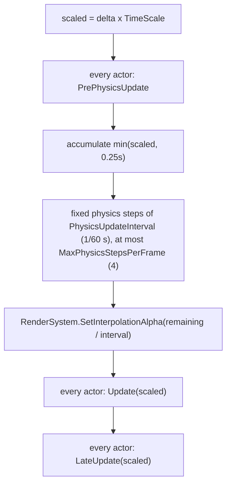
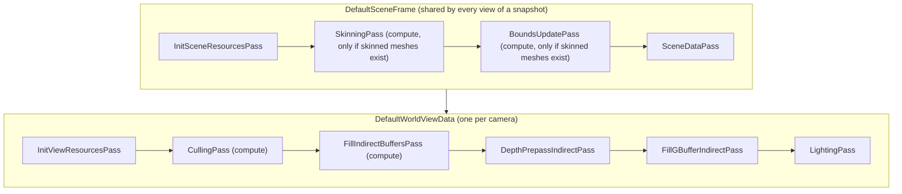

# Rin.World

The scene layer on top of [Rin.Core](../Rin.Core/ReadMe.md). A `World` owns actors, each actor owns components, and the world drives a fixed-step physics simulation and a render proxy table. It also contains the default deferred render pipeline and the `Viewport` view that shows a world inside a Rin.Core surface.

## Where it fits

- References (from `Rin.World.csproj`): Rin.Core, `Shade/Rin.Shade`, `Shade/Rin.Shade.SourceGenerator` and Rin.SourceGenerators (both as analyzers), and the `BepuPhysics` package.
- Referenced by: Rin.GLTF and Rin.World.Tests.
- Shaders are C# classes that derive from `Shader` in Rin.Shade, see [Shade](../../Shade/ReadMe.md). The `[Shader("Shaders/Rin/World/...")]` attributes name the compiled output, which the Rin.Shade targets write to `Content\Shaders\Rin\World\` and embed in the assembly.
- `WorldContent` is a module initializer that adds the embedded `World` and `Shaders/Rin/World` content to `Global.Sources`.

## The model

There is no ECS here. It is an actor and component model, similar to a classic game object tree.

| Type | Role |
| --- | --- |
| `World` | Implements `IUpdatable`. Holds actors by string id, an `IRenderSystem` and an `IPhysicsSystem`, both passed to the constructor. |
| `Actor` | A bag of `IComponent`s keyed by type, with an optional `RootComponent`. Transform helpers (`SetLocation`, `Translate`, `GetTransform` and so on) forward to the root. An actor with no root cannot be transformed or drawn. |
| `Component` | Base class with `Start`, `Stop`, `Update`, `LateUpdate`, `PrePhysicsUpdate` and `ProcessHit`. |
| `WorldComponent` | A component with a local location, rotation and scale, a parent (`TransformParent`), children and an optional named attach point. It caches its world transform and bumps `TransformVersion` on every recompute. |

`Space` is `Local` or `World` and is passed to the transform getters and setters.

Components that exist:

- `StaticMeshComponent` and `SkinnedMeshComponent`: draw a mesh with one `IMeshMaterial` per surface.
- `CameraComponent`: field of view (default 90), near plane (0.01) and far plane (50). Any actor can carry one.
- `PointLightComponent` and `DirectionalLightComponent` (both derive from `LightComponent`: `Color`, `Radiance`, `Radius`).
- `BoxPhysicsComponent`, `SpherePhysicsComponent`, `CapsulePhysicsComponent` (derive from `SingleBodyPhysicsComponent`).
- `SurfaceComponent`: holds an `Extent` and a `VirtualSurface` whose input methods are stubs.

`WorldExtensions.CreateMeshEntity` adds an actor with a `StaticMeshComponent`.

### The update loop

`World.Update(deltaSeconds)` does nothing until `Start()` has been called. When active it runs:



- If the step cap is reached, the leftover time is dropped instead of carried over.
- `TimeScale` is clamped to zero or more.
- `Stop()` stops the actors, then calls `PhysicsSystem.Destroy()` and `RenderSystem.Dispose()`.

### Physics

`IPhysicsSystem` is the abstraction (create box, sphere or capsule bodies, velocity, pose and mass accessors, per-body time scale, collision channels, ray, shape cast and overlap queries). `Physics/Bepu/BepuPhysicsSystem` implements it on BepuPhysics: it owns a Bepu `Simulation`, runs `Simulation.Timestep` in `Update`, and hands out `PhysicsBodyHandle` values (an index plus a version, so a stale handle is rejected).

`PhysicsState` has three values, and `SingleBodyPhysicsComponent` treats them differently:

- `Static`: placed once when the component starts, never moved by the component afterwards.
- `Controlled`: in `PrePhysicsUpdate` the component pushes its world position and orientation into the body.
- `Simulated`: in `Update` the component reads position, orientation and scale back from the body with `SetTransform(..., Space.World)`.

`World.RegisterPhysicsBody` and `FindPhysicsOwner` map a body handle back to the component that owns it. `World.GetGravity` and `SetGravity` forward to the physics system (Bepu default gravity is `(0, -9.81, 0)`).

### Meshes and materials

- `StaticMesh` and `SkinnedMesh` only hold a `MeshId`. `IMeshFactory.Get().GetMesh(id)` returns the GPU-side `IMesh` (a `DeviceMesh` made by `MeshFactory`, which uploads vertex and index buffers on a background task). A component whose mesh is not ready when it starts creates no render proxy.
- A mesh has `MeshSurface` ranges. A component resolves one `IMeshMaterial` per surface from its `Materials` array, reusing the last material when the array is shorter, with `DefaultMeshMaterial.DefaultMesh` as the starting fallback.
- `IMeshMaterial` exposes a `ColorPass` and a `DepthPass`, both `IMaterialPass`. `DefaultMeshMaterial` is the one implementation here: base color, metallic, specular, roughness and emissive values, each with an optional texture handle.
- `Vertex` holds location, normal, UV and a tangent field that is marked not used.

### Lights

`LightInfo` is a packed struct (three `Vector4`s) with location, radius, direction, color, radiance and `LightType` (`Directional` or `Point`). Light components create a render proxy on `Start` and push a new `LightInfo` in `LateUpdate` when their transform version changed.

### Animation

Skinning data and animation live under `Mesh/Skinning`:

- `Skeleton` (bones, parent indices, name lookup, `BasePose`), `SkeletalPose`, `AnimationClip` with `BoneCurve`s, and `BoundAnimationClip`.
- `IPoseSource` supplies a pose and is ticked by `SkinnedMeshComponent.Update`.
- `AnimationGraph` is the `IPoseSource` implementation. It evaluates an `IPoseNode` tree each tick: `ClipPlayerNode`, `BlendNode` and `StateMachineNode` (states with `AnimationTransition` conditions and blend durations).
- Clips can carry notifies and notify states. The graph collects them while evaluating and `SkinnedMeshComponent` fires them after the tick, then releases them back to their factories.
- A child component attached to a skinned mesh by bone name gets that bone's transform through `GetAttachPointTransform`.

## How the world reaches the renderer

Components never touch GPU state. They talk to `IRenderSystem` through proxy handles:


- `DefaultRenderSystem` enqueues every proxy change on a `ConcurrentQueue`. `Snapshot(camera, extent)` drains the queue, rebuilds the `DefaultWorldSnapshot` only if something changed or the interpolation alpha changed, and returns a new `DefaultWorldViewData`.
- `World.Update` sets the interpolation alpha, and the snapshot blends each proxy's previous and current transform by it, so fixed-step physics renders smoothly.
- Mesh components push a new transform only when `TransformVersion` changed. Skinned components push the pose every `LateUpdate`.

## The default render pipeline

Everything is in `Graphics/Default`. `DefaultWorldViewData.Write` adds the passes to a Rin.Core render graph. The scene half (`DefaultSceneFrame`) is created once per snapshot per graph through `GetOrAddShared`, so several views of the same world share it.



| Pass | Reads | Writes |
| --- | --- | --- |
| `InitSceneResourcesPass` | each processed surface's `Bounds` | bounds buffer (one `Bounds3D` per surface) |
| `SkinningPass` | source vertex buffers, one pose matrix buffer per skinned mesh | one shared skinned output buffer of `Vertex` (`SkinningShader`) |
| `BoundsUpdatePass` | skinned output buffer | the skinned surfaces' entries in the bounds buffer, recomputed from the skinned vertices (`BoundsUpdateShader`) |
| `SceneDataPass` | processed meshes and their materials | per batch: material data buffers (color and depth) and `IndirectMeshRecord` buffers |
| `InitViewResourcesPass` | nothing | creates GBuffer0..3 and the depth image, clears color to zero and depth to 0 |
| `CullingPass` | bounds buffer | culling result buffer, one `uint` per surface (`CullingShader`) |
| `FillIndirectBuffersPass` | culling results, mesh records | per batch `DrawIndexedIndirectCommand` buffer and a draw count (`DrawIndirectShader`), for color and depth batches |
| `DepthPrepassIndirectPass` | indirect commands, depth material data, skinned output | depth image (`MeshDepthShader`) |
| `FillGBufferIndirectPass` | depth image, indirect commands, color material data, textures, skinned output | GBuffer0..3 (`MeshShader`, depth write disabled) |
| `LightingPass` | GBuffer0..3, the light array | the output image, `RGBA16` (`LightingShader`, full screen triangle pair) |

How meshes are batched: `DefaultSceneFrame` turns every surface of every static, then skinned, mesh into a `ProcessedMesh`, and groups them by `BatchKey` (index buffer plus material identity) separately for color and depth. Each group becomes one indirect draw, so `FillGBufferIndirectPass` and `DepthPrepassIndirectPass` issue one `DrawIndexedIndirectCount` per group.

### Shaders

All are `Shader` subclasses in `Graphics/Default/Shaders` unless noted.

- `MeshShader`: vertex stage fetches the vertex from a buffer by vertex id and instance id, transforms it, and the fragment stage returns a `GBufferOutput`. Base color, roughness, metallic, specular and emissive come from a bindless texture when the handle is set, otherwise from the material constants.
- `GBufferOutput`: four `RGBA32` color targets. Layout as written by `MeshShader`: GBuffer0 is color and roughness, GBuffer1 is world location and metallic, GBuffer2 is normal and specular, GBuffer3 holds emissive in `x`.
- `GBufferHandles`, `GBufferSample` and the `SampleGBuffer` extension on `BindlessData` read the four targets back into one sample struct.
- `LightingShader`: draws six vertices, calls `SampleGBuffer`, starts from the emissive value and adds `DisneyModel.Eval` for each light, then converts to the output color space with `LightMath`.
- `MeshDepthShader`: depth only version of the mesh vertex stage.
- `CullingShader`, `DrawIndirectShader`, `SkinningShader`, `BoundsUpdateShader`: compute shaders for the passes above.
- `ViewportShader` (in `Views/Shaders`): see below.

## Showing a world in a view

`Viewport` in `Views/ViewportCommandHandler.cs` (a Rin.Core `ContentView`) takes a `CameraComponent`.

1. In `CollectContent`, on the collect thread, it calls `RenderSystem.Snapshot(camera, renderSize)` and adds a `DrawViewportCommand` holding that snapshot, the on-screen size and transform, and the selected `ViewportChannel`.
2. `ViewportCommandHandler` handles those commands. In `PreAdd` it calls `Write` on each snapshot, which adds the pipeline passes above to the graph. In `Configure` it reads each snapshot's output image and GBuffer images, and in `Execute` it draws a quad with `ViewportShader`.
3. `ViewportShader` shows `OutputImage` for `ViewportChannel.Scene`, or one GBuffer channel (`Color`, `Location`, `Normal`, `RoughnessMetallicSpecular`, `Emissive`), or a `Radiance` view that sums `N.L` times radiance, color and attenuation over the lights.
4. A primary cursor click on a viewport cycles the channel. A secondary click captures the mouse and calls `OnMouseDelta`, which does nothing in the base class.
5. The render target size follows the content size only after it has been stable for `Viewport.SettleFrames` frames (default 5), so resizing stretches the last render instead of reallocating the GBuffers each frame.

The pipeline is selected by the `IRenderSystem` the world is created with. `Examples/SceneTest` builds `new World(new DefaultRenderSystem(), new BepuPhysicsSystem())`, calls `Start()`, and gives each camera actor a `Viewport` subclass.

## Build and test

```
dotnet build Engine/Rin.World/Rin.World.csproj
dotnet test Engine/Rin.World.Tests/Rin.World.Tests.csproj -p:RinShadeSkipCompile=true
```

The tests mirror the folders here (components, render system, physics, skinning, animation, world time scale) and use fakes from `TestDoubles.cs`. Building without `RinShadeSkipCompile=true` compiles the shaders and needs the real Slang native package. See [Rin.World.Tests](../Rin.World.Tests/ReadMe.md).

## Gotchas

- `Culling` does not cull. `CullingShader` writes `1` for every surface, and `DefaultWorldViewData.ViewFrustum` is computed but not read by any pass.
- `BoundsUpdatePass` recomputes the bounds of skinned surfaces from the skinned vertices after `SkinningPass`. It had been commented out and was re-enabled against the current scene frame. That version builds and the unit tests pass, but it has not been run on a GPU. `CullingShader` still marks every surface visible and never reads the bounds, so the updated bounds are not used for anything yet.
- `ShadowPass` exists but its `Execute` throws `NotImplementedException` and nothing adds it to the graph. There is no shadowing.
- Lights reach the renderer only through proxies. There is no light system or other world-level system layer.
- `Component.Collect` and `CommandList` (the older collect path) are not called by anything outside the components themselves. The render system path is the live one.
- Physics components do not call `DestroyBody` or `UnregisterPhysicsBody` when they stop. Bodies are only released by `PhysicsSystem.Destroy()` when the world stops.
- `Box`, `Sphere` and `Capsule` physics components throw `NotImplementedException` from `ProcessHit`.
- `World.GetActors()` allocates a new array on every call, and `Actor.Update` copies its component list each frame.
- A mesh component only creates its render proxy in `Start` if the mesh is already in `IMeshFactory`. A mesh that finishes uploading later is not picked up.
- `Vertex` has a tangent field marked not used, and `NormalImageId` is stored in the material data but `MeshShader` never samples it.
