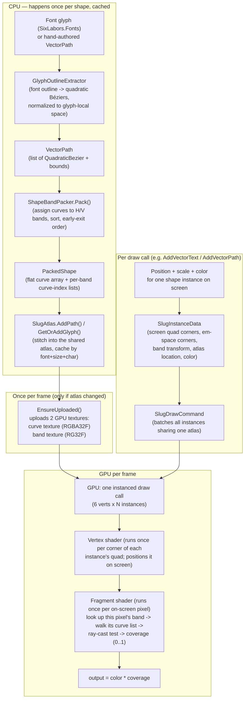

# How `experiment.Slug` Works — From Zero to Implementing It Yourself

This document explains the SLUG vector-rendering technique used in `experiment.Slug/`, starting
from "what problem does this even solve" and ending with enough detail that you could re-implement
it from scratch in a different engine.

It walks through the actual code in this repo (`experiment.Slug/Rendering/*.cs` and
`experiment.Slug/Content/Slug/slug.slang`) and explains *why* each piece exists, not just what it
does.

**No coding background needed to start.** [§0](#0-before-we-start-the-idea-in-plain-english) explains
the entire idea in plain language, no jargon. Everything after that gets progressively more
technical, but every technical term is defined in plain words the first time it's used — and the
[Glossary](#14-glossary) collects them all in one place if you lose track.

---

## Table of Contents

0. [Before we start: the idea, in plain English](#0-before-we-start-the-idea-in-plain-english)
1. [The problem SLUG solves](#1-the-problem-slug-solves)
2. [SLUG vs. SDF vs. MSDF/MTSDF](#2-slug-vs-sdf-vs-msdfmtsdf)
3. [The core idea in one picture](#3-the-core-idea-in-one-picture)
4. [Building block: the quadratic Bézier curve](#4-building-block-the-quadratic-bézier-curve)
5. [Building block: point-in-shape via ray casting](#5-building-block-point-in-shape-via-ray-casting)
6. [The problem with "just test every curve"](#6-the-problem-with-just-test-every-curve)
7. [The fix: bands (spatial acceleration)](#7-the-fix-bands-spatial-acceleration)
8. [End-to-end pipeline in this repo](#8-end-to-end-pipeline-in-this-repo)
9. [CPU side, file by file](#9-cpu-side-file-by-file)
10. [The GPU textures ("the atlas")](#10-the-gpu-textures-the-atlas)
11. [The draw call: instances, push constants, buffers](#11-the-draw-call-instances-push-constants-buffers)
12. [The shader, line by line](#12-the-shader-line-by-line)
13. [Anti-aliasing: how it gets smooth edges for free](#13-anti-aliasing-how-it-gets-smooth-edges-for-free)
14. [Glossary](#14-glossary)
15. [Build-it-yourself checklist](#15-build-it-yourself-checklist)
16. [Running the demo](#16-running-the-demo)

---

## 0. Before we start: the idea, in plain English

Skip this section if you already think in code and shaders. If not, **start here** — everything
below uses ordinary words. No programming background needed.

Imagine you drew the letter "e" by hand, as one continuous pen stroke that loops around and comes
back to where it started, plus a small closed loop inside for the counter (the little enclosed hole
in the "e"). You didn't shade it in — you just kept the outline: the exact path the pen traveled,
described mathematically ("start here, curve to here, curve to here...").

Now you want to display that letter on a screen, which is really a huge grid of tiny colored
squares (**pixels** — think of an enormous sheet of graph paper, one little square per dot of
light). For every single square in that grid, there's one question to answer: *"is this square
inside the pen stroke's outline, or outside it?"* Answer that for every square, color the "inside"
ones in and leave the "outside" ones blank, and you've drawn the letter.

The classic trick for answering "is this point inside the outline?" is: draw an imaginary straight
line from that point off into the distance, and count how many times it crosses the pen stroke.
Cross it an odd number of times → you're inside. An even number (including zero) → you're outside.
This exact trick is also what makes a hole (like the counter of an "e" or "o") work automatically:
the little loop that forms the hole is drawn winding in the *opposite* direction from the outer
loop, so inside the hole the two crossings cancel each other out and the test correctly reports
"outside" again.

**This is the entire idea behind SLUG:** keep every letter as its original, exact pen-path
description — never flatten it into a picture — and for every tiny square on screen, run this
"count the crossings" test directly against the real path. Because you're always testing the
*exact* path, never a picture of it, the letter stays perfectly crisp no matter how large or small
you draw it. There's no baked image to zoom into and see go blurry, because there never was one.

The one snag with doing this literally: a fancy letter might be described by 50+ curved pen
segments. Testing all 50 for every single on-screen square, for every letter, every single frame,
many times a second, is a lot of repeated work. Most of the cleverness in this codebase (the
"bands" you'll meet later) is just a **filing system**: pre-sort each letter's pen segments into
folders by roughly where they sit, so that when you're testing one particular screen square, you
only ever open *its own* folder — a handful of segments — instead of dumping out and checking all 50
every time.

That's the whole idea. Everything from here on is "how do you actually build that filing system,
and how do you get a graphics chip to run the crossing-count test for every square on screen, fast
enough to do it 60+ times a second." It gets technical quickly — but every term gets defined in
plain words the moment it shows up.

---

## 1. The problem SLUG solves

You want to draw text and vector art (icons, shapes, whatever) on the **GPU** (the graphics chip
that actually paints pixels to your screen — separate from, and much faster at this specific job
than, your computer's main processor) so that it stays perfectly crisp whether it's 8px tall or
800px tall. The letter "O" zoomed way in should still have a mathematically perfect round curve,
not a blurry or jagged one.

There are three traditional approaches, and each has a real downside:

| Approach | How it works | Downside |
|---|---|---|
| **Bitmap fonts** | Pre-render each glyph to a small picture (texture), stretch it when drawing | Blurry/jagged at large sizes — you baked in a fixed resolution |
| **Signed Distance Fields (SDF)** | Store, at every texture pixel, the distance to the nearest edge; reconstruct a sharp edge with a threshold | Rounds off sharp corners, still blurs at extreme zoom, needs a generation pass per font/size (see [§2](#2-slug-vs-sdf-vs-msdfmtsdf) for the full story, including the MSDF/MTSDF fix) |
| **Mesh tessellation** | Convert the outline into a triangle mesh and rasterize it like any other 3D model | Expensive to tessellate per glyph, curves need many tiny triangles to look smooth, doesn't scale to lots of on-screen text |

**SLUG's trick:** don't approximate the outline at all. Store the *exact* mathematical curves (a
handful of numbers per curve) in a texture (here used not as a picture, but as a plain data
array), and in the pixel-coloring step, for every single pixel, ask "is this exact point inside or
outside the exact curve outline?" directly — the same "count the ray crossings" test from
[§0](#0-before-we-start-the-idea-in-plain-english). Since the outline description never loses
precision, the shape is perfectly sharp at any zoom level — you're evaluating the exact same math
whether the letter is 1px or 10,000px tall.

The catch: naively, this means every pixel has to check *every* curve in the shape. Most of this
document is about the trick (called **band partitioning**) that makes that cheap enough to run in
real time.

This implementation is a from-scratch Slang port of Eric Lengyel's reference **Slug** library and
the algorithm from the paper *"GPU-Accelerated Path Rendering"* (JCGT vol 6 no 2, 2017). The
original patent has been dedicated to the public domain.

---

## 2. SLUG vs. SDF vs. MSDF/MTSDF

The table above already named Signed Distance Fields as one alternative. Because MSDF/MTSDF
specifically is the modern, most commonly recommended alternative to what this project does (used
by libraries like `msdfgen`, and by engines like Godot and many custom UI toolkits for crisp GPU
text), it deserves a direct, honest comparison against what SLUG does here.

### What an SDF actually is

Instead of storing a picture of the letter, a **Signed Distance Field** stores, at every texel
(one cell of a texture used as raw data rather than a picture) of a small baked texture, a single
number: *how far is this texel from the nearest point on the outline*, with the sign telling you
which side you're on (say, negative = inside, positive = outside). To draw the letter, the
**fragment shader** — the small GPU program that runs once per on-screen pixel and decides that
pixel's final color — samples that texture and checks whether the value there is negative or
positive: solid color where it's negative, and a smooth blend across the handful of texels where it
crosses zero. That zero-crossing blend is what gives an SDF glyph a clean anti-aliased edge from a
fairly low-resolution texture — which is why SDF text has been the standard cheap, fast approach in
real-time UI and games for years.

**Where plain SDF breaks down:** a distance field is built by asking, for each texel, "what's the
single closest edge to this point?" Near a sharp corner (the point of a capital "A", a serif), two
different edges are both close to the same texel, and a single distance value can't represent "two
edges meet here at a sharp point" — it just picks one nearby edge, and the reconstructed corner ends
up looking subtly rounded. Zoom in far enough on SDF text and a corner that should be a crisp point
looks soft. Because it's still a texture with a fixed resolution, extreme zoom also softens edges
generally, just less obviously than a bitmap font would.

### MSDF — fixing the rounded-corner problem

**Multi-channel Signed Distance Field** (the technique behind the popular `msdfgen` tool) fixes
exactly that corner problem. Instead of one distance value per texel, it stores **three** — in the
texture's red, green, and blue color channels — where each channel is built from only a subset of
the outline's edges. The edges are pre-sorted into three groups so that every sharp corner's two
neighboring edges always land in *different* channels. The fragment shader then reconstructs the
true edge by taking the **median** (the middle value, not the average) of the three channels at
each texel, instead of trusting one value. That median trick is what preserves the corner: at a
sharp corner, the three channels disagree in exactly the way that lets the median reconstruct a
genuinely sharp point instead of a rounded one. The result: SDF's cheap sampling and smooth
zero-crossing anti-aliasing, but with corners that stay crisp.

### MTSDF — MSDF plus one more channel

**Multi-channel + True Signed Distance Field** adds a fourth channel (alpha) alongside the three
MSDF channels: a plain, ordinary single-channel true distance value, computed the old SDF way. Why
bother, if MSDF already reconstructs the shape correctly? Because the median-of-three value MSDF
uses is only meaningful as "which side of the edge am I on" — it isn't a real, physically accurate
distance anywhere except right at an edge. Effects like a soft drop-shadow, an outer glow, or a
fixed-width outline stroke all want a genuine "how far is this point from the edge" answer,
everywhere, not just near the edge — so MTSDF keeps a real distance channel around specifically for
those effects, while still using the three MSDF channels to draw the crisp core glyph shape itself.

### The actual comparison

| | SDF | MSDF | MTSDF | SLUG (this project) |
|---|---|---|---|---|
| **What's stored per glyph** | One baked distance value per texel | Three baked distance values per texel | Three baked + one true distance value per texel | The exact curve control points — nothing is baked or approximated |
| **Sharp corners** | Round off | Preserved (median trick) | Preserved (median trick) | Always exact — it's the literal curve math, not a reconstruction |
| **Extreme zoom** | Softens (still a finite-resolution bake) | Softens (still a finite-resolution bake) | Softens (still a finite-resolution bake) | Stays perfectly sharp — the same equation is evaluated regardless of scale |
| **Needs an offline "bake" step per glyph/size** | Yes — distance-field generation | Yes — plus a harder edge-coloring/assignment step | Yes — both of the above | No — the atlas packing in this repo is pure bookkeeping (sort curves into bands); no distance computation happens at all |
| **Per-pixel runtime cost** | Very cheap: one filtered texture sample + a smooth threshold | Cheap: one filtered texture sample (3 channels) + a median + a smooth threshold | Same as MSDF for the glyph, plus an optional extra channel read for effects | Costlier: walk a handful of curves per band, per axis, per pixel — bounded by banding, but still real per-pixel math |
| **Free extra effects (glow, outline, drop shadow)** | Natural — you already have a distance value | Natural for the core shape; the true-distance need is only partly met | Natural *and correct* — the true-distance channel exists exactly for this | Not built in — "coverage" here isn't a distance metric, so effects like this would need separate logic added |
| **Texture memory per glyph** | Small, fixed size regardless of outline complexity | Small, fixed size (roughly 3x an SDF's channel count, still tiny) | Same as MSDF plus a little more | Grows with outline complexity — more curves means more data stored in the atlas |
| **Cost scaling with shape complexity** | Flat — generation cost only, paid once, offline | Flat, paid once, offline (edge-coloring gets fiddlier on very fine detail) | Flat, paid once, offline | Scales with curve count at **draw time** — an intricate vector logo has more curves to test every single frame, even with banding |

**In short:** (M)(T)SDF pays a one-time, offline cost to bake an approximation, then samples that
approximation extremely cheaply forever after — and MSDF/MTSDF specifically patched the one
weakness (rounded corners) that made plain SDF unsuitable for crisp typography and iconography.
SLUG pays no baking cost and involves no approximation at all — it is always exactly correct at any
zoom level — but it pays for that with genuine per-pixel curve-testing work at *draw* time, every
frame, which is exactly the cost the band-partitioning scheme in [§7](#7-the-fix-bands-spatial-acceleration)
exists to keep bounded.

---

## 3. The core idea in one picture

```
                     CPU (once, when a shape is first used)                 GPU (every frame, every pixel)
                     ───────────────────────────────────────                ──────────────────────────────
   Font file  ──►  [glyph outline as curves]  ──►  [pack into bands]  ──►  [2 small textures]  ──►  [ray-cast test per pixel]
   or hand-       (list of quadratic Bézier      (spatial index so a     (curve data +            → coverage (0..1)
   drawn shape     curves forming closed          pixel only checks a     "which curves are        → color × coverage
                   loop(s))                        few curves, not        near me" index)
                                                    all of them)
```

Everything expensive (extracting the outline, building the spatial index) happens **once** on the
CPU (your computer's general-purpose processor) and is cached. Everything that happens **per
pixel, per frame** runs on the GPU and is cheap: look up "which curves are near me" in a small
texture, test a handful of curves, done.

---

## 4. Building block: the quadratic Bézier curve

Every outline SLUG draws — every letter, every hand-drawn shape — is represented as a closed loop
of **quadratic Bézier curves**. A quadratic Bézier curve is defined by 3 points: a start point
`P0`, a control point `P1` that "pulls" the curve, and an end point `P2`:

```
        P1  (control point — the curve bends toward this but never touches it)
        ●
       ╱ ╲
      ╱   ╲
     ╱     ╲
    ●───────●
   P0        P2
 (start)    (end)
```

The formula for any point on the curve at parameter `t` (0 at the start, 1 at the end) is:

```
C(t) = (1-t)² · P0  +  2t(1-t) · P1  +  t² · P2
```

This is `QuadraticBezier.cs` (`experiment.Slug/Rendering/QuadraticBezier.cs:9`) — a plain struct
(a small bundle of related values treated as one unit) holding `P0`, `P1`, `P2`.

**Straight lines are curves too.** Instead of having a separate "line segment" type, a straight
line from `A` to `B` is just a degenerate quadratic where the control point is duplicated as the
end point: `{A, B, B}`. Plug that into the formula above and every term with `P1` and `P2` becomes
identical, so the curve collapses to a straight line. This is a real trick documented in the
original Slug README, and it means the whole rest of the pipeline (packing, texture layout,
shader) only ever has to deal with *one* curve type. See `QuadraticBezier.Line()` at
`experiment.Slug/Rendering/QuadraticBezier.cs:11`.

An outline (a "contour") is just a closed loop of these curves, end-to-end, back to the start:

```
        contour = [curve0, curve1, curve2, curve3, ...]   where curve[i].P2 == curve[i+1].P0
                  and the last curve's end == the first curve's start (closed loop)
```

A shape can have **multiple contours** — e.g. the letter "O" is an outer ring plus an inner ring
(the hole). Both live in the same `VectorPath` (`experiment.Slug/Rendering/VectorPath.cs:8`); the
holes are handled automatically by the winding-rule math described next, not by any special-casing
in the code.

---

## 5. Building block: point-in-shape via ray casting

This is the actual test SLUG runs, once per pixel, to decide "is this pixel inside the shape, and
by how much (for anti-aliasing, i.e. smooth, non-jagged edges)?" It's the same crossing-count idea
introduced in plain language in [§0](#0-before-we-start-the-idea-in-plain-english), now made
precise.

The classic way to test whether a point is inside a closed polygon: **cast a ray from the point
out to infinity in some direction, and count how many times the ray crosses the outline.** Odd
number of crossings = inside. Even = outside.

```
                 outline (closed contour)
              ┌──────────────────╮
              │                   ╲
     ray ─────┼──────●            │      ● = query point
              │      ▲             │      ray crosses the outline once (odd) → point is INSIDE
              │      query          ╲
              └───────────────────────╯
```

SLUG refines this in two ways:

1. **Signed crossings, not just a count ("nonzero winding rule").** Each crossing adds `+1` or
   `-1` depending on which direction the curve was heading when it crossed the ray (left-to-right
   vs right-to-left). Sum them up: nonzero = inside, zero = outside. This is what makes holes work
   for free — the inner ring of an "O" winds in the opposite direction from the outer ring, so its
   crossings cancel the outer ring's crossings inside the hole, correctly leaving the hole "outside".

2. **Two rays, not one — one horizontal, one vertical.** SLUG casts a horizontal ray *and* a
   vertical ray from every pixel, gets a coverage estimate from each, and blends them together
   (see [§13](#13-anti-aliasing-how-it-gets-smooth-edges-for-free)). Two independent estimates make
   the anti-aliasing much more robust — a single ray direction can be fooled by curves that happen
   to run nearly parallel to it.

Instead of a binary inside/outside answer, SLUG computes *how far* the nearest crossing is from
the pixel center and turns that into a fractional **coverage** value between 0 and 1 — that
fractional value is exactly what gives smooth, not jagged, edges.

---

## 6. The problem with "just test every curve"

A glyph outline might have 30–80 curves. A complex vector icon might have hundreds. If every pixel
touched by the shape has to test *every single curve* against both a horizontal and vertical ray,
that's a lot of shader work repeated millions of times per frame. This is the actual performance
problem SLUG needs to solve — the ray-casting math itself is cheap, but doing it against every
curve for every pixel is not.

---

## 7. The fix: bands (spatial acceleration)

The fix is a spatial index (a filing system — the same idea introduced informally in
[§0](#0-before-we-start-the-idea-in-plain-english)): **split the shape's bounding box into strips
("bands"), and record which curves overlap which strip.** Then a pixel only has to test the curves
in *its own* strip, not every curve in the shape.

SLUG uses two independent sets of bands:

- **Horizontal bands** — the bounding box is sliced into horizontal strips (dividing up the
  Y-axis). Used for the **horizontal ray test** (a pixel's horizontal ray only needs to check
  curves in the same horizontal strip as the pixel).
- **Vertical bands** — the bounding box is sliced into vertical strips (dividing up the X-axis).
  Used for the **vertical ray test**.

```
   Horizontal bands (default: 8)              Vertical bands (default: 8)
   divide the Y axis into strips              divide the X axis into strips
   ┌─────────────────────────┐                ┌───┬───┬───┬───┬───┬───┬───┬───┐
   │▓▓▓▓▓▓▓▓▓▓▓▓▓▓▓▓▓▓▓▓▓▓▓▓▓│ band 0          │▓  │▓  │▓  │   │   │▓  │   │   │
   ├─────────────────────────┤                │▓  │▓  │▓  │   │   │▓  │   │   │
   │░░░░░░░░░░░░░░░░░░░░░░░░░│ band 1          │▓  │▓  │▓  │▓  │▓  │▓  │   │   │
   ├─────────────────────────┤                │▓  │▓  │▓  │▓  │▓  │▓  │   │   │
   │▓▓▓▓▓▓▓▓▓▓▓▓▓▓▓▓▓▓▓▓▓▓▓▓▓│ band 2          └───┴───┴───┴───┴───┴───┴───┴───┘
   ├─────────────────────────┤ ...              band: 0   1   2   3   4   5   6   7
   │           ...           │
   └─────────────────────────┘
   Each band stores a LIST of the curve         Each band stores a LIST of the curve
   indices that pass through that Y-range.      indices that pass through that X-range.
```

A curve is added to every band it overlaps (bands slightly overlap each other via a small epsilon
so a curve sitting exactly on a boundary is never dropped from either neighbor — see
`BandOverlapEpsilon` in `ShapeBandPacker.cs:12`).

**One more optimization: skip curves that can never cross the ray for that band type.** A
perfectly horizontal line segment can never cross a horizontal ray (they're parallel — infinite or
zero intersections, never counted), so it's excluded from horizontal bands entirely (and
vice-versa for vertical lines/vertical bands). See `IsFlatX` / `IsFlatY` on
`QuadraticBezier.cs:20-21` and their use in `ShapeBandPacker.cs:44,54`.

**One more optimization: sort each band's curve list, so the shader can stop early.** Within a
band, curves are sorted by how far away their *farthest point* is (descending). The shader walks
the list and the moment it hits a curve whose farthest extent is already behind the pixel (further
than the ray needs to travel), every remaining curve in the (sorted) list is *also* guaranteed to
be behind it, so the shader can `break` out of the loop immediately instead of testing the rest.
See the `sortKeyDescending` sort in `ShapeBandPacker.cs:100` and the `break` in the shader at
`slug.slang:139` / `slug.slang:178`.

This is the entire performance story: **spatial partitioning (bands) + early-exit sorting** turn an
O(all curves) per-pixel cost into an O(few curves in my own band) cost.

---

## 8. End-to-end pipeline in this repo



In prose:

1. **Get an outline.** Either extract a font glyph's outline (`GlyphOutlineExtractor`) or hand-author
   one (like the star in `SlugApplication.BuildStarPath()`), producing a `VectorPath`.
2. **Pack it into bands.** `ShapeBandPacker.Pack()` turns the `VectorPath` into a `PackedShape`: a
   flat curve array plus, for each band, the list of curve indices in that band.
3. **Stitch it into the shared atlas.** `SlugAtlas.AddPath()` appends the packed shape's data into
   two growing CPU-side arrays (which later become the two GPU textures) and remembers where this
   shape's data landed (`AtlasShapeEntry`). Glyphs are cached by `(font family, size, codepoint)` so
   the same letter is never packed twice.
4. **Upload once per frame, if dirty.** `SlugAtlas.EnsureUploaded()` uploads the accumulated arrays
   as two textures only if something new was added since last upload.
5. **Build one instance per drawn shape.** `AddVectorPath` / `AddVectorText` build a
   `SlugInstanceData` per shape occurrence — where on screen, what scale, what color, and which
   atlas location to read from — and batch all instances sharing an atlas into one
   `SlugDrawCommand`.
6. **One instanced GPU draw call** renders all instances: the vertex shader expands each instance
   into a screen quad, and the fragment shader does the actual per-pixel ray-cast + coverage test
   described in [§12](#12-the-shader-line-by-line).

---

## 9. CPU side, file by file

### `QuadraticBezier.cs` — the curve primitive
Already covered in [§4](#4-building-block-the-quadratic-bézier-curve). Also exposes `Min`/`Max`
(its own bounding box) and `IsFlatX`/`IsFlatY` (used to skip degenerate curves from a given band
axis).

### `VectorPath.cs` — a shape as a list of curves
A `record` (an immutable data-holder type in C#) holding `Curves` plus a computed
`BoundsMin`/`BoundsMax` (with a small margin, so curves sitting exactly on the boundary don't get
clipped by band-index rounding later).

### `GlyphOutlineExtractor.cs` — turning a font glyph into a `VectorPath`
This implements `SixLabors.Fonts`'s `IGlyphRenderer` interface, which calls back with drawing
commands (`MoveTo`, `LineTo`, `QuadraticBezierTo`, `CubicBezierTo`, ...) as it walks a glyph's
outline data. The extractor just records those callbacks as `QuadraticBezier`s:

- `LineTo` → `QuadraticBezier.Line()` (the degenerate-quadratic trick from [§4](#4-building-block-the-quadratic-bézier-curve)).
- `CubicBezierTo` (only needed for OpenType/CFF fonts — TrueType is already quadratic) → **degree
  reduction**: split the cubic into two quadratics via the standard Tiller-Hanson midpoint
  construction (`GlyphOutlineExtractor.cs:44-58`).
- `EndFigure` → if the contour never explicitly closed itself, add a closing line back to the
  start point (`GlyphOutlineExtractor.cs:68-74`) — without this the winding-number test would see
  an open contour and get the wrong crossing count.

Finally, `GetNormalizedPath()` shifts all the coordinates so the glyph's own bounds top-left is the
origin — this is what lets one packed glyph shape be reused (cached) and drawn at any screen
position/size, since "position on screen" is handled entirely separately (in the instance data),
never baked into the curve coordinates themselves.

### `ShapeBandPacker.cs` — the spatial index builder
Already covered in [§7](#7-the-fix-bands-spatial-acceleration). Its output, `PackedShape`, is
purely a CPU-side intermediate — it never touches the GPU directly. Two things worth calling out
in the code:

- `curveTexels` packs **8 floats per curve**: `p0.x, p0.y, p1.x, p1.y, p2.x, p2.y, 0, 0` — this
  layout is chosen to match the GPU curve-texture format exactly (2 RGBA32F texels per curve; see
  [§10](#10-the-gpu-textures-the-atlas)).
- `BuildBands` is a single generic method used for *both* horizontal and vertical bands, just fed
  different axis-selector functions (`getMin`/`getMax`/`isDegenerate`/`sortKeyDescending`) — that's
  why the horizontal-band call reads "Y" fields and the vertical-band call reads "X" fields.

### `PackedShape.cs`
Just a data holder tying together the curve texel array and the two lists of per-band curve
indices, documented inline.

---

## 10. The GPU textures ("the atlas")

`SlugAtlas.cs` is the part that actually talks to the GPU. It owns two textures that the shader
reads not as normal filtered/sampled pictures, but as **flat data arrays** — every read is a raw
`TexelLoad` (fetch the exact value stored at one integer coordinate, no blending with neighbors) at
an exact integer coordinate.

Both textures are `TextureWidth = 4096` texels wide (must match `kBandWidth` in `slug.slang:34`)
and grow taller as more data is appended; addressing wraps rows automatically (see `CalcBandLoc`
below).

### Curve texture (RGBA32F — 4 float channels per texel)
2 texels per curve:

```
 texel 0:  (p0.x, p0.y, p1.x, p1.y)
 texel 1:  (p2.x, p2.y,   0,    0 )
```

### Band texture (RG32F — 2 float channels per texel)
One contiguous block per shape, starting at that shape's `shapeLoc` (`BandTexX`,`BandTexY` in
`AtlasShapeEntry`):

```
 [0 .. bandCountY-1]                     H(horizontal)-band headers: (count, listOffset)
 [bandCountY .. bandCountY+bandCountX-1] V(vertical)-band headers:   (count, listOffset)
 [listOffset ..]                         curve index entries: (curveTexelX, curveTexelY)
```

A "header" is just 2 numbers: how many curves are in this band, and where (as an offset from the
shape's own block origin) that band's list of curve-texel-coordinates starts. The actual list
entries then each point directly at a curve's texel-0 location in the *curve* texture.

> **Why floats for what are conceptually integers?** The reference Slug implementation uses 16-bit
> integer texture channels. Rin's graphics abstraction has no integer texture format, so this port
> uses float32 channels for both textures instead — every value stored (counts, offsets, texel
> coordinates) is a small integer, and float32 represents integers up to 2^24 exactly, so nothing
> is lost.

### Wraparound addressing: `CalcBandLoc`
Both textures are conceptually one long 1-D array that's been wrapped into 4096-wide rows (because
GPU textures need 2D coordinates, not an arbitrary 1-D index). `CalcBandLoc` in `slug.slang:38-42`
converts "shape origin + offset" into an actual `(x, y)` texel coordinate:

```
absolute = shapeLoc.x + offset
result   = ( absolute & 4095,  shapeLoc.y + (absolute >> 12) )
           (      x-in-row  ,        which row     )
```

`SlugAtlas.AddPath()` performs the equivalent math on the CPU (`% TextureWidth` / `/ TextureWidth`)
when it records where each new shape's data landed, and when it writes each curve-index entry
(`WriteCurveRef` in `SlugAtlas.cs:112-118`).

### Registering shapes
- `AddPath(VectorPath)` — packs and stitches an arbitrary shape into the atlas, returns a `uint`
  shape id you use in draw calls. This is what the hand-authored star in the demo uses.
- `GetOrAddGlyph(Font, char)` — same thing, but for a font glyph, with a cache keyed on
  `(font family, size, codepoint)` so repeated letters (or repeated draws of the same text) reuse
  one packed shape.
- `EnsureUploaded()` — lazily re-uploads the two textures only if something changed (`_dirty`)
  since the last upload; cheap to call every frame.

---

## 11. The draw call: instances, push constants, buffers

Every time you want a shape to actually appear on screen at some position/scale/color, you create
one `SlugInstanceData` (`experiment.Slug/Rendering/SlugInstanceData.cs:9`) — one "instance" meaning
one occurrence of that shape being drawn somewhere:

| Field | Meaning |
|---|---|
| `MinPos` / `MaxPos` | The screen-space rectangle (in pixels/clip space) the shape's quad will cover |
| `MinEm` / `MaxEm` | The corresponding "em-space" (the shape's own local curve-coordinate space) values at those same two corners — this is what lets the shader map "which pixel am I" back to "where is that in the shape's own curve coordinates" |
| `Banding` | The `(scale, offset)` that converts an em coordinate into a band index for *this* shape (computed once per shape in `AtlasShapeEntry`, copied into every instance that uses it) |
| `ShapeLocX/Y`, `BandMaxX/Y` | Where in the band texture this shape's data block lives, and how many bands it has (for clamping) |
| `Color` | Straight RGBA multiplied by the computed coverage |

`AddVectorPath` (`SlugDrawCommand.cs:81-114`) builds this from a shape id + screen position + scale
+ color, looking up the shape's cached `AtlasShapeEntry`. It also **expands the quad by 1 pixel** on
every side — the antialiasing kernel in the shader samples roughly half a pixel past the exact
mathematical edge, so without this margin the very edge of the glyph would get clipped by the quad
boundary itself.

`AddVectorText` (`SlugDrawCommand.cs:116-134`) is a thin loop over characters: measure each
character's position via `SixLabors.Fonts`' `TextMeasurer`, resolve/cache its glyph shape via
`atlas.GetOrAddGlyph`, and call `AddVectorPath` for each non-whitespace character.

All instances that share the same `SlugAtlas` get batched into a single `SlugDrawCommand`
(`FindExistingCommand` reuses an existing command in the same `CommandList` rather than creating a
new one per glyph) — so one whole string of text becomes **one instanced draw call**, not one draw
call per letter.

At execution time (`SlugDrawHandler.Execute`, `SlugDrawCommand.cs:51-74`):
1. `Atlas.EnsureUploaded()` — make sure the textures are current.
2. All the frame's `SlugInstanceData` structs (small fixed-layout data records, one per instance)
   are written into one GPU buffer (a block of raw memory the GPU can read).
3. A single **push constant** struct (`SlugPush`) is set up with the buffer's GPU address, handles
   to the two atlas textures, and the current projection matrix — push constants are a small, very
   fast per-draw-call block of data, cheaper to update than a full buffer/descriptor.
4. One `Draw(6, instanceCount)` call — 6 vertices (2 triangles = 1 quad) per instance, instanced
   `instanceCount` times (the GPU repeats the same 6-vertex quad for every instance, each reading
   its own row of instance data).

---

## 12. The shader, line by line

`experiment.Slug/Content/Slug/slug.slang` has a vertex stage and a fragment stage — the two kinds
of small programs a GPU runs to turn triangles into colored pixels. The **vertex shader** runs once
per corner of a shape (positioning it in screen space); the **fragment shader** runs once per
resulting on-screen pixel (deciding its final color).

### Vertex stage (`slug.slang:247-258`)
For vertex `vid` (0..5) of instance `iid`, it looks up that instance's `SlugInstanceData`, picks
which corner of the quad this vertex is (`kCorners` table — two CCW triangles), and:
- linearly interpolates between `minPos`/`maxPos` for the actual screen position, and
- linearly interpolates between `minEm`/`maxEm` for the em-space coordinate,

...then passes both `emCoord` and `instanceId` down to the fragment stage. Nothing curve-related
happens here at all — all the real work is per-pixel.

### Fragment stage (`slug.slang:260-274`)
Looks up the instance again (by `instanceId`), calls `SlugRender()` with this pixel's interpolated
`emCoord` plus the instance's band-transform/atlas-location info, and outputs `color * coverage`.

### `SlugRender()` (`slug.slang:110-199`) — the actual per-pixel test
This is the heart of the whole technique. Per pixel:

1. **`pixelsPerEm = 1 / fwidth(emCoord)`** — `fwidth` is a built-in GPU function that answers "how
   much does `emCoord` change between this pixel and its neighbor?" Its reciprocal answers "how
   many em-space units fit in one screen pixel here" — this is what lets the anti-aliasing math
   below stay correctly scaled regardless of how zoomed-in the shape currently is.
2. **`bandIndex`** — convert this pixel's em coordinate into a `(vertical-band, horizontal-band)`
   index pair using the instance's `banding` transform, clamped to the shape's actual band count.
3. **Horizontal band block** (`slug.slang:124-157`): read that band's header (count + list offset)
   from the band texture, then loop over its curve list:
   - Read the curve's 2 texels from the curve texture, subtract `emCoord` so the curve's
     coordinates become **relative to this pixel** (pixel is now the origin — this is why the
     shader can treat the ray as "does this curve cross y = 0").
   - **Early exit**: if even the curve's farthest-right point is more than half a pixel to the left
     of this pixel, `break` — every remaining curve in this sorted list is even further away.
   - `CalcRootCode` inspects the sign pattern of the curve's 3 y-values to decide whether this
     curve has a genuine crossing at parameter `t1`, `t2`, both, or neither (this is a small bit
     trick ported verbatim from the reference implementation).
   - `SolveHorizPoly` solves the actual quadratic for the x-position(s) where the curve crosses
     `y = 0` (i.e. crosses the pixel's horizontal ray).
   - Each genuine crossing adds a signed, distance-weighted contribution to `xcov` (coverage) and
     `xwgt` (confidence weight — how close the crossing was to the pixel center).
4. **Vertical band block** (`slug.slang:163-196`): the mirror image — tests the downward ray using
   `SolveVertPoly`, accumulating `ycov`/`ywgt`.
5. **`CalcCoverage`** blends the two independent estimates into one final 0..1 coverage value (see
   [§13](#13-anti-aliasing-how-it-gets-smooth-edges-for-free)).

The output color is `instanceColor * coverage` — fully opaque where coverage is 1 (deep inside the
shape), fully transparent where it's 0 (outside), and smoothly blended within about half a pixel of
the true mathematical edge.

---

## 13. Anti-aliasing: how it gets smooth edges for free

This is the part that makes SLUG look good instead of just correct. Two ideas combine:

**1. Sub-pixel crossing position → fractional coverage.**
Instead of asking "did the ray cross, yes/no", the shader solves for *exactly where* (in em-space,
then converted to pixel units via `pixelsPerEm`) the crossing happened relative to the pixel
center, then runs it through `saturate(r + 0.5)`. If the crossing is dead-center (`r = 0`), that's
`0.5` coverage — half in, half out, exactly what you want for a boundary passing through the pixel
center. If the crossing is a full pixel to one side (`r = ±0.5`... at the edges of the `[-0.5, 0.5]`
window), coverage saturates to `0` or `1` — the pixel is confidently fully outside or fully inside.
This single expression is what turns a hard binary edge into a smooth 1-pixel-wide gradient.

**2. Two independent rays, blended by confidence, not just averaged.**
A single ray direction can give an unreliable coverage estimate when a curve runs nearly parallel
to it (near-tangent crossings are numerically noisy). So SLUG computes both a horizontal-ray
estimate (`xcov`) and a vertical-ray estimate (`ycov`), each with its own **confidence weight**
(`xwgt`/`ywgt` — how close the nearest crossing was to the pixel center; a crossing far from center
is a weaker signal). `CalcCoverage` (`slug.slang:98-103`) then does a confidence-weighted blend of
the two, falling back to `min(|xcov|, |ycov|)` as a safety net for edge cases where both signals are
weak. The result is much more robust than trusting either ray alone — this is precisely why SLUG
casts *two* rays instead of the textbook single-ray point-in-polygon test from [§5](#5-building-block-point-in-shape-via-ray-casting).

Net effect: smooth, stable anti-aliasing that holds up correctly even on nearly-horizontal or
nearly-vertical edges, at any zoom level, without ever pre-rendering to a fixed resolution.

---

## 14. Glossary

| Term | Meaning here |
|---|---|
| **Pixel** | One dot of light on a screen — the smallest unit of the on-screen grid |
| **GPU** | The graphics chip that runs the small, massively-parallel programs which decide what color every pixel on screen ends up being |
| **Shader** | One of those small GPU programs; a **vertex shader** positions geometry, a **fragment shader** decides one pixel's color |
| **Contour** | One closed loop of curves (e.g. the outer ring of an "O") |
| **Winding rule (nonzero)** | A point is "inside" if the sum of signed ray-crossings is nonzero; this is what makes holes (inner contours winding the opposite direction) work automatically |
| **Em-space** | A shape's own local coordinate system, independent of where/how big it's drawn on screen — the same cached glyph shape is reused at any screen position by just changing the em-space ↔ screen-space mapping in the instance data |
| **Band** | A strip of a shape's bounding box (horizontal or vertical) holding the list of curves that overlap it — the spatial index that avoids testing every curve per pixel |
| **Texel** | One "pixel" of a texture used as raw storage — read via `TexelLoad` at an exact integer coordinate, no filtering |
| **Coverage** | A 0..1 fractional "how much of this pixel is inside the shape" value — the source of anti-aliasing |
| **Instance** | One occurrence of a shape being drawn somewhere on screen (one `SlugInstanceData`); many instances can share one atlas shape (e.g. every occurrence of the letter "e") |
| **Atlas** | The shared pair of GPU textures (curve data + band data) holding every packed shape currently in use |
| **Buffer** | A block of raw memory the GPU can read directly — used here to hold the frame's array of `SlugInstanceData` |
| **Push constants** | A small, fast, per-draw-call block of GPU data (here: buffer address + texture handles + projection matrix) — cheaper to update than a full descriptor/uniform buffer |
| **SDF / MSDF / MTSDF** | Signed / Multi-channel / Multi-channel-plus-True Distance Field — the leading *baked-approximation* alternative to SLUG's *exact-math* approach; see [§2](#2-slug-vs-sdf-vs-msdfmtsdf) |

---

## 15. Build-it-yourself checklist

If you wanted to implement this technique yourself (in any engine/API), here's the order of
operations that this codebase follows:

1. **Curve representation.** Define a quadratic Bézier struct (`P0, P1, P2`). Represent straight
   lines as `{A, B, B}` so you only ever need one curve type.
2. **Outline extraction.** Get outlines as closed loops of these curves — from a font library's
   glyph-outline callback API (degree-reduce cubics to quadratics if needed), or hand-author them.
   Normalize each shape to its own local origin so it can be cached and reused at any screen
   position/scale.
3. **Band packing (per shape, once, cached).**
   - Compute the shape's bounding box.
   - Choose a band count (8×8 is a reasonable default).
   - For horizontal bands (dividing Y): for each curve not flat-in-Y, add it to every band its
     Y-range overlaps (with a small epsilon so boundary curves aren't dropped).
   - Do the mirror image for vertical bands (dividing X), skipping flat-in-X curves.
   - Sort each band's curve list descending by the curve's farthest extent, so the shader can
     early-exit.
4. **Pack into two flat GPU-texture-shaped arrays:**
   - A curve array: 2 texels (or equivalent) per curve, holding `P0, P1, P2`.
   - A band array: per shape, a small header table (`count, listOffset` per band) followed by the
     actual lists of curve-texel-locations for each band.
   - Track, per shape, where its data block starts, plus the em-space ↔ band-index transform
     (`scale = bandCount / boundsSize`, `offset = -boundsMin * scale`).
5. **Upload lazily.** Re-upload the two textures only when new shapes were added.
6. **Per draw:** build one instance record per on-screen occurrence: screen-space quad corners,
   matching em-space corners, the shape's band transform + atlas location, and a color. Expand the
   screen quad by ~1px so the antialiasing kernel isn't clipped. Batch same-atlas instances into one
   instanced draw call.
7. **Vertex shader:** expand each instance into its screen quad; interpolate the em-space
   coordinate per-vertex so the fragment shader gets it per-pixel.
8. **Fragment shader, per pixel:**
   - Compute `pixelsPerEm` from the screen-space derivative of the em coordinate (`fwidth` or
     equivalent).
   - Look up this pixel's band index in each axis.
   - Walk each band's curve list (with early exit), solving each curve for where it crosses the
     pixel's horizontal/vertical ray, accumulating signed, distance-weighted coverage and a
     confidence weight per axis.
   - Blend the two axes' coverage estimates by confidence into one final 0..1 value.
   - Output `color * coverage`.

---

## 16. Running the demo

`experiment.Slug/Program.cs` registers the project's `Content/` folder as a content source and runs
`SlugApplication`. `SlugApplication.SetupDemo` (`experiment.Slug/SlugApplication.cs:38-62`) builds
one `SlugAtlas`, registers a hand-drawn 5-pointed star (`BuildStarPath`) plus two lines of live text
via `AddVectorText`, and adds it all to a `CanvasView`. Run it like any other example project in
this repo (`dotnet run` from `experiment.Slug/`); resize the window and note the text/star stay
perfectly sharp at any size — that's the whole point.
