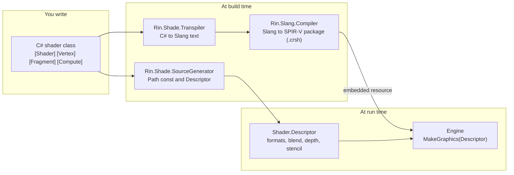
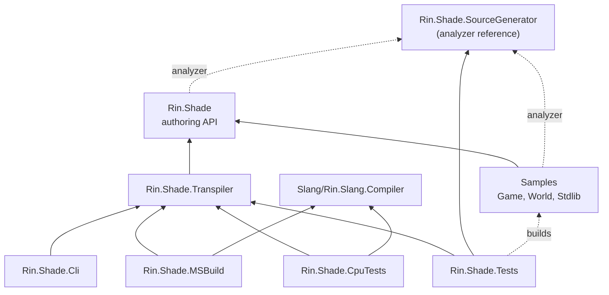
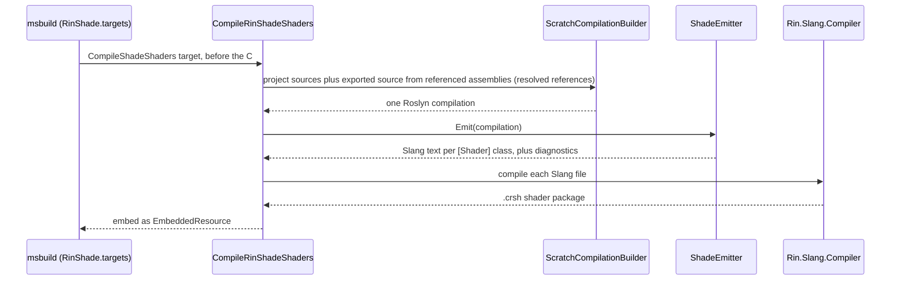
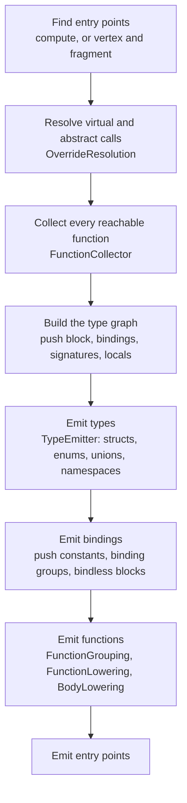
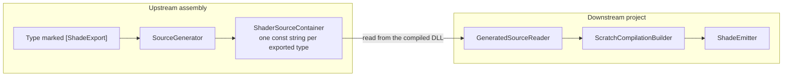

# Shade

Rin.Shade lets you write shaders in C#. A Roslyn-based transpiler turns the C# shader classes into Slang source, the Slang toolchain (`Slang/`) compiles that to a shader package, and the package is embedded in the consuming assembly. The engine loads it by the path you gave the shader class.

## The big picture



Two things come out of one C# class. The transpiler and Slang compiler produce the shader code. The source generator produces a typed `Descriptor` on the same class, so the pipeline state (attachment formats, blend state, depth and stencil use, thread-group size) is read from the C# attributes instead of being recovered from the compiled shader.

## Projects

| Project | What it is |
| --- | --- |
| [Rin.Shade](Rin.Shade/ReadMe.md) | The authoring API: `Shader` base class, attributes, intrinsics, `BufferRef<T>`, descriptors. |
| [Rin.Shade.Transpiler](Rin.Shade.Transpiler/ReadMe.md) | The Roslyn transpiler from C# shader classes to Slang text (`ShadeEmitter`). |
| [Rin.Shade.SourceGenerator](Rin.Shade.SourceGenerator/ReadMe.md) | Roslyn source generators: `Path` constant, `Descriptor`, and exported shader source. |
| [Rin.Shade.MSBuild](Rin.Shade.MSBuild/ReadMe.md) | The `CompileRinShadeShaders` MSBuild task used by `msbuild/RinShade.targets`. |
| [Rin.Shade.Cli](Rin.Shade.Cli/ReadMe.md) | `rin-shade compile`, a command line wrapper over the transpiler. |
| [Rin.Shade.Tests](Rin.Shade.Tests/ReadMe.md) | Snapshot and unit tests for the transpiler and generators (no native Slang needed). |
| [Rin.Shade.CpuTests](Rin.Shade.CpuTests/ReadMe.md) | Runs transpiled shaders on the CPU through the real Slang. |
| [Samples](Samples/ReadMe.md) | SampleStdlib, SampleWorld and SampleGame, three chained assemblies used by cross-assembly tests. |



Solid arrows are project references. Dotted arrows are an analyzer reference (a project runs the source generator on its own compile; the generator references nothing) or a build-order-only reference (the tests build the sample projects so their DLLs exist, without referencing their output). Engine projects that contain shaders reference the generator as an analyzer too.

## What a shader looks like

A shader is a class that derives from `Rin.Shade.Shader`. This invented one draws a full-screen gradient and blends a tint over it:

```csharp
using System.Numerics;
using Rin.Shade;

namespace Demo;

[Shader("Shaders/Demo/tint.slang")]
public partial class TintShader : Shader
{
    public struct PushConstants
    {
        public Vector4 Tint;
        public float Strength;
    }

    public struct VertexIn
    {
        [VertexId] public int VertexId;
    }

    public struct VertexOut
    {
        [Position] public Vector4 Position;
        [Semantic("UV")] public Vector2 Uv;
    }

    [Push] protected PushConstants Push;

    protected override BlendState BlendState => BlendState.Alpha;

    [Vertex]
    public VertexOut Vertex(VertexIn input)
    {
        var uv = new Vector2((input.VertexId << 1) & 2, input.VertexId & 2);

        VertexOut output;
        output.Uv = uv;
        output.Position = new Vector4(uv * 2f - new Vector2(1f), 0f, 1f);
        return output;
    }

    [Fragment, Attachment(AttachmentFormat.RGBA16)]
    public Vector4 Fragment(VertexOut input)
    {
        var gradient = new Vector4(input.Uv, 0f, 1f);
        return Shader.Math.Lerp(gradient, Push.Tint, Push.Strength);
    }
}
```

Running it through the transpiler (`rin-shade compile`) gives this Slang (trimmed to the parts that matter):

```slang
namespace Demo::TintShader
{
    struct PushConstants { float4 tint; float strength; }
    struct VertexIn      { int vertexId : SV_VertexID; }
    struct VertexOut     { float4 position : SV_Position; float2 uv : UV; }
}

using namespace Demo::TintShader;
using namespace Demo;

[[vk::push_constant]] uniform ConstantBuffer<PushConstants, ScalarDataLayout> push;

[shader("vertex")]
VertexOut vertex(VertexIn input)
{
    var uv = float2(input.vertexId << 1 & 2, input.vertexId & 2);
    VertexOut output;
    output.uv = uv;
    output.position = float4(uv * 2 - float2(1), 0, 1);
    return output;
}

[shader("fragment")]
float4 fragment(VertexOut input)
{
    var gradient = float4(input.uv, 0, 1);
    return lerp(gradient, push.tint, push.strength);
}
```

What to notice:

- Names become lowerCamelCase, and C# namespaces become Slang namespaces. Nested types live in a namespace named after their shader class.
- `[Push]` becomes the `push` push-constant uniform, and `[VertexId]`, `[Position]` and `[Semantic("UV")]` become Slang semantics on the struct fields. Semantics only go on struct fields, so entry points take a struct.
- `Shader.Math.Lerp` is an intrinsic that maps to Slang's `lerp`. Plain C# (`var`, `new Vector4(...)`, operators, shifts) is translated as written.
- Semantic attributes are valid only on struct fields, and the C# compiler rejects them on parameters. That is why entry points take a struct.
- A construct the transpiler cannot translate is reported as a diagnostic in your build output.

From the same class the source generator adds a typed descriptor, which the engine passes to `MakeGraphics`:

```csharp
TintShader.Descriptor                // GeneratedDescriptor
TintShader.Descriptor.Output.Format  // the color attachment format (RGBA16 here)
```

The descriptor also carries the blend state, which the generator copies from the `BlendState` override above, so the class is never instantiated. A shader that returns a struct with several attachments gets one property per attached field (`Output.GBuffer0Format` and so on).

### Sharing code with base classes

Shaders can derive from other shader classes. A base class can own the blend state, an entry point, helper methods and abstract hooks, and a derived class overrides the hooks. The transpiler flattens the inheritance chain, so the emitted Slang is one file with the base class's helpers and the derived class's overrides together. Base classes can also be generic, which is how one fragment entry point can be shared across several shaders that differ only in their input struct. The Rin.Core view shaders use this pattern.

## The attributes

| Attribute | Goes on | Meaning |
| --- | --- | --- |
| `[Shader("path")]` | class | The path the compiled shader is registered under. |
| `[Compute(x, y, z)]` | method | Compute entry point and its thread-group size. |
| `[Vertex]`, `[Fragment]` | method | Graphics entry points. |
| `[Attachment(format)]` | fragment method or output field | Color attachment format. |
| `[Depth]`, `[Stencil]` | entry point | The stage uses the depth or stencil attachment. |
| `[Push]` | field | The push-constant block, lowered to a uniform named `push`. |
| `[BindingGroup]` | static field | A group of resources in one descriptor set (a Slang `ParameterBlock`). |
| `[BindlessBlock("name")]` | struct | An engine-owned resource table, such as the global bindless pool. |
| `[SlangExpression("...")]`, `[SlangStatement("...")]` | method without a body | Binds a call to a Slang expression or statement, with `@0`, `@name`, `@T0` and `@this` placeholders. |
| `[ShadeExport]` | class or struct | Makes the type's source available to other assemblies' shaders. |

Semantic helpers (`[Position]`, `[VertexId]`, `[InstanceId]`, `[Target(n)]`, and the compute thread ids) put Slang semantics on stage input and output fields. The full list, with the exact meaning of each, is in `Rin.Shade/Attributes.cs`.

## How a shader goes from C# to a compiled shader



1. The `CompileShadeShaders` target in `msbuild/RinShade.targets` runs before the project's own C# compile (`BeforeTargets="BeforeCompile;AssignTargetPaths"`) and calls the `Rin.Shade.MSBuild` task. The task builds one compilation from the project's sources plus the exported source of the referenced assemblies, and calls `ShadeEmitter.Emit`.
2. During the project's normal C# compile, `Rin.Shade.SourceGenerator` adds a `Path` constant and a `Descriptor` to each `partial` shader class, and embeds the source of `[ShadeExport]` types as constants for downstream projects.
3. The emitter lowers each `[Shader]` class to Slang text. C# it cannot translate becomes a diagnostic (an error in your build output), not wrong shader code.
4. The Slang goes to a scratch location under the project's `obj` folder and is compiled by `Rin.Slang.Compiler`. The resulting `.crsh` file is embedded as an `EmbeddedResource`. No `.slang` file is written into the tracked tree. To look at the Slang, build with `-p:RinShadeDumpGenerated=true` and read the output directory's `GeneratedShaders` folder.
5. At run time the Vulkan backend reads the `.crsh` for the descriptor's `Path`, takes the SPIR-V for each stage, and takes the pipeline state from the descriptor.

## Inside the transpiler

For one shader class, `ShaderLowering` runs these steps in order:



- **Entry points first:** the class is checked for a valid combination (compute, or vertex with an optional fragment), with diagnostics for conflicts or duplicates.
- **Inheritance is flattened:** the transpiler walks the base-class chain, so a base class's shared code and an override both end up in one Slang file.
- **Types by reachability:** only types the shader actually reaches are emitted. They are grouped into Slang namespaces that mirror the C# ones, and names are written relative to the namespace they sit in.
- **Functions in order:** Slang needs a function defined before use, so helpers come out dependency-first. Extension-style helpers are grouped into `extension` blocks.

## Calling code in other assemblies

A shader can derive from a base class, or call a helper, that lives in another project. The transpiler needs that code's source, not just its compiled form, so the pieces travel as source text:



`Rin.Core` marks types such as `BindlessData`, `ResourceHandle`, `Int4` and `ViewShader` with `[ShadeExport]`, and the shaders in `Rin.World` and the examples use them. `Samples/` exists to test this path with three chained assemblies.

## Build integration

A project that contains Shade shaders sets `RinShadeDiscoverPrefix` (the path prefix its `[Shader]` paths start with) and `RinShadeOutputSubpath`, then imports `msbuild/RinShade.targets`. `Engine/Rin.Core/Rin.Core.csproj` is an example. See [Rin.Shade.MSBuild](Rin.Shade.MSBuild/ReadMe.md) for the properties and gotchas.

Two flags you will use:

- `-p:RinShadeSkipCompile=true` skips shader compilation entirely, for builds and tests that never load shaders (it is what CI uses for most test projects).
- `-p:RinShadeDumpGenerated=true` writes the emitted Slang to a `GeneratedShaders` folder in the output directory.

The `Rin.Shade.MSBuild` task is brought up to date, in Release, before each shader compile, so a transpiler change takes effect on the next build. It runs in a short-lived task host process, which costs about two seconds on a full solution build and keeps the task DLLs from being locked.

## Testing

| Test project | What it proves | Needs native Slang |
| --- | --- | --- |
| `Rin.Shade.Tests` | The emitted Slang text is what we expect (snapshot files), diagnostics fire, generators emit the right source. Set `RIN_SHADE_SNAPSHOTS=update` to refresh snapshots. | No |
| `Rin.Shade.CpuTests` | A transpiled shader, compiled to host code and run on the CPU, computes the same numbers as `System.Numerics`. This is what pins the matrix convention (row-major, row-vector). | Yes |

In CI the first runs on stub native packages in its own job. The second runs in a job that builds the real native Slang.
